# 1 Optical fibre communication: introduction

## 1.1 Uses of optical fibre in communication

Using optical fibres, very high data rates (gigabits per second and higher) can be transmitted over long distances (tens of kilometres) without amplifiers or regenerators. As a consequence, optical fibre has completely superseded copper wires as the primary medium for cabled transmission over long distances. Until recently, however, optical fibre has been used less in LANs, where twisted-pair copper cable has been dominant. Similarly, fibre has been slow to penetrate the access network, from homes or businesses to the first telephone exchange.

Here I will make the distinction between the *access network* (from homes or businesses to the first telephone exchange – also called the last mile, local loop, or subscriber network) and the *core network* (between exchanges, also called the trunk network).

As demand for capacity has risen, however, the merits of optical fibre become ever more significant, and fibre is now being used even in LANs and the access network.

The way in which fibre is used is also changing. Originally, fibre was used just for stand-alone point-to-point links. Signal processing – amplification, regeneration, switching and routeing, for example – was done in electronic components. Now, however, devices for optical signal processing have been developed so that ‘all-optical networking’ is possible.

In this unit the basics of communication over optical fibre are covered in Section 2 and the components such as amplifiers and switches are introduced in Section 3.

## 1.2 Wavelength or frequency?

In this unit you will find frequent references both to the wavelength of light and the frequency of light. It is important to be able to work with both, and convert from one to the other. In the context of optical-fibre communication, the light radiation we are concerned with is usually in the infrared region of the spectrum.

To identify the position in the electromagnetic spectrum it is usual to refer to the wavelength of light, rather than its frequency. Thus I will refer to the ‘1300 nm window’ rather than the 2.3 × 1014 Hz (230 THz) window. T is the SI prefix ‘tera’, the multiplier for 1012.

When talking about the details of the optical spectrum both wavelengths and frequencies are used. In dense wavelength division multiplexing, for example, the carriers are often referred to by their frequencies rather than their wavelengths, and it is important to be able to convert readily from one to the other.

The conversion between wavelength (lambda, λ) and frequency (*f*) uses the formula:

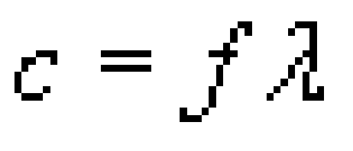

where *c* is the speed of light in free space (i.e. in a vacuum) which is

3.00 × 108 m s−1 to three significant figures. This may be rearranged to give:

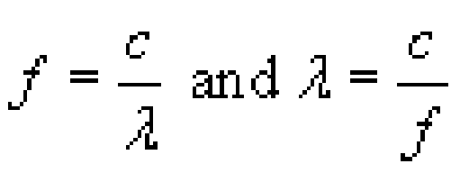

Note that because the speed used is that of light in free space, references to wavelength are to the wavelength of the light in free space, which is different from (i.e. longer than) the wavelength of the same light in a fibre. When light enters a fibre from free space (or air) it slows down but the frequency remains the same, so the wavelength decreases.

You need to be careful when converting between wavelength and frequency spacings or ranges, rather than individual values. For example, let's suppose you know the output from a light-emitting diode (LED) contains wavelengths between 1300 nm and 1320 nm so that the spectral width is 20 nm and you want to know the frequency range in hertz.

To get the exact frequency range you need to convert each end of the range to frequencies and subtract one from the other. Thus the spectrum of the LED output in this example extends from

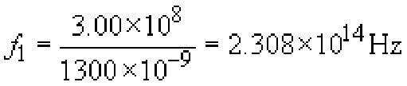

to

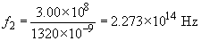

The spectral range expressed in frequencies is therefore:

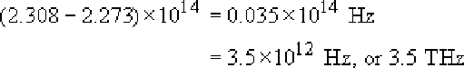

Notice that you have to be careful with the accuracy of the intermediate steps in this calculation because it involves subtracting two large and similar numbers.

For small spectral widths there is an approximation formula to convert between spectral width measured in wavelength (Δλ) and spectral width measured in frequency (Δ*f*):

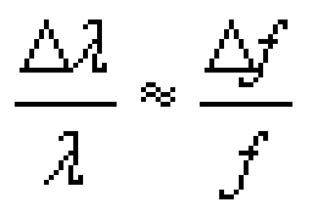

where λ and *f* are taken at the mid-point of the range. This approximation is valid provided the fractions are small – less than about 1/10, for which we require Δλ &lt; λ/10. In fact, because the approximation avoids the need to subtract two large numbers, it can be a better way of doing the calculation.

Often we may know λ but not *f*, so we can use *f* = *c/λ* to get:

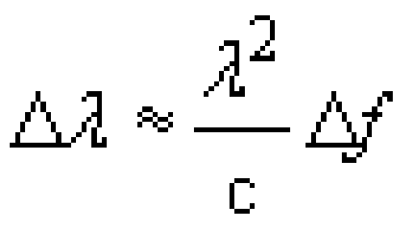

and therefore:

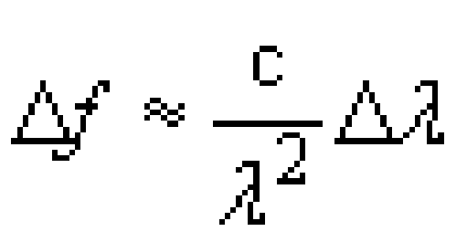

Using the example of the LED again, taking λ in the middle of the range at 1310 nm gives:

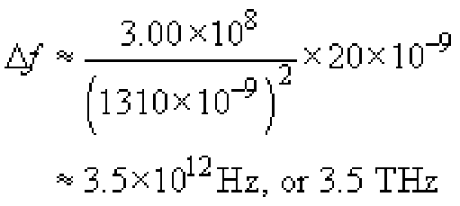
<!--SAQ id=saq001_001-->

### SAQ 1

#### Question

Suppose an LED has a spectrum that extends from 1540 nm to 1560 nm. Calculate:

1. 
its spectral width in nm

2. 
its centre frequency in Hz

3. 
its spectral width in Hz.

#### Answer

1. 
Its spectral width in nanometres is 1560 – 1540=20 nm.

2. 
Its central wavelength is 1550 nm, which corresponds to a frequency of

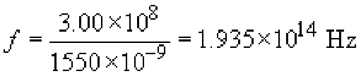

3. 
Its spectrum extends from

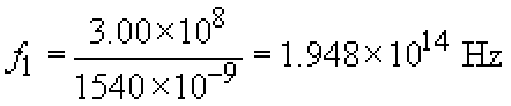

to

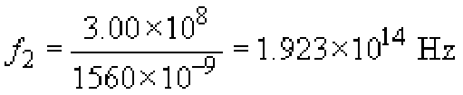

which is a spectral width of

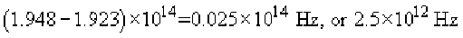

Alternatively, this can be calculated using the approximation formula:

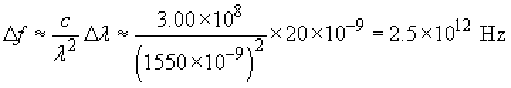

Notice that the spectral width of the LED in this SAQ measured in terms of *wavelength* was the same as that in the example given in Section 1.2, i.e. 20 nm. The spectral width measured in frequency is different, however: 3.5 × 1012 in one case and 2.5 × 1012 here. They are different because the centre wavelength is different.
<!--ENDSAQ-->
