# 2 Elements of an optical-fibre link

## 2.1 Light sources and detectors

The basic building blocks of an optical-fibre link are the light source, the fibre and the detector (<a xmlns:str="http://exslt.org/strings" href="">Figure 1</a>).

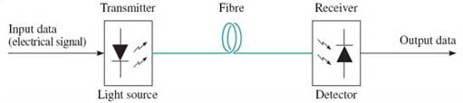

Figure 1 An optical-fibre link

There are broadly speaking two categories of device used as light sources: *light-emitting diodes* (LEDs) and *laser diodes*. In general terms, LEDs are cheaper and easier to use, but have inferior performance compared to laser diodes.

The output from an LED differs from that of a laser diode as it is possible to couple more light power from a laser diode than from an LED to an optical fibre, and the spectral linewidth of an LED is much broader than that of a laser diode.

The lower power coupling from an LED comes partly from the fact that LEDs generally emit lower light power than laser diodes (the output from an LED is typically no more than −10 dBm), but also because the light from an LED spreads into a broader beam than the light from a laser diode. This latter point – the broader beam – means in particular that it is not possible to couple light from an LED very efficiently into a single-mode fibre, and in practice LEDs are only used with multimode fibre.

*Single-mode laser diodes*, can have spectral widths of 10 MHz or less. Narrow spectral width is particularly important at high signalling rates and in dense wavelength division multiplexed (DWDM) systems, so single-mode laser diodes are used in these systems. But there are further considerations that come into play to ensure a narrow spectrum – in particular, the mechanism used to modulate the light is important.

'Single-mode’, as used in ‘single-mode laser diode’, refers to a characteristic of the way in which the laser operates and of the resulting output spectrum. It does *not* have the same meaning as ‘single-mode’ as used in ‘single-mode fibre’.

The original – and cheapest – way to modulate a laser (or an LED) is to vary the electrical supply to the device. Modulation of an LED by a digital signal is done by switching the electrical current supplying the device on and off. Laser diodes can be modulated in a similar way, but for operation at high rates it is better not to switch the laser off completely so that the modulation is strictly ASK (amplitude shift keying) rather than OOK (on-off keying). The extent to which the laser goes off is expressed by the *extinction ratio*, re, defined by:

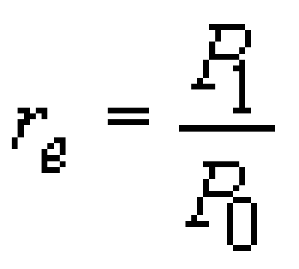

where *P*1** is the high optical power level and *P*0 is the low optical power level.

### Activity 1

#### Question

What is the extinction ratio: (a) if the low power is half the high power, and (b) if the light is switched completely off (i.e. true OOK)? If all other things are equal, which would give the better performance: high or low extinction ratio?

#### Answer

* 
(a) If *P*0 is half *P*1 then re=2

* 
(b) If *P0* is zero then the extinction ratio is infinite.

The higher the extinction ratio the greater the distinction between the two signalling states, so high extinction ratio is better (all other things being equal).

The problem with modulating a laser diode by varying the electrical current supply (a technique known as *direct modulation*) is that the physics of laser diodes is such that the output wavelength varies with the electrical current. So as the electrical current is switched from high to low, and vice versa, the output wavelength also varies. This effect is called *chirp*, and results in an increase in the spectral width of the laser output. Chirp can be avoided by running the laser continuously at a constant high level (referred to as *continuous wave*, cw, operation), and modulating with a device that in some way attenuates the transmitted light under the (electrical) control of the modulating signal. This approach to modulation is described as *external modulation*. (Sometimes in practice the ‘external’ modulator might be physically integrated with the laser diode.) An additional advantage of external modulation is that it can allow the use of higher extinction ratios.

A further refinement in the development of lasers in recent years is that it is now possible to buy *tuneable lasers*: lasers for which the wavelength can be varied under electrical control. Tuneable lasers are useful in wavelength division multiplexed systems and in optical networks, as will be discussed later.

The detector is a semiconductor device known as *a photodiode* which provides an electrical current output which is proportional to the intensity of light falling on it. That is all you need to know about detectors for the purposes of this course, except perhaps to note that the speed at which a photodiode can react to changes in the light intensity is sometimes the factor that limits the maximum signalling rate over an optical-fibre link, but that recent developments in the technology have increased the speed at which photodiodes can operate.
<!--SAQ id=saq21-->

### SAQ 2

#### Question

Optical-fibre transmission systems in the core network (between cities, international links, etc.) now invariably use lasers as the light source, but most optical-fibre systems in LANs use LEDs. Why do you think this is?

#### Answer

Transmission in the core network can make use of high signalling rates and needs to transmit over long distances, so the systems benefit from the power and modulation speed possible with lasers. LANs, on the other hand, generally need only short-distance transmission and don't need the speed over long distances that only lasers can deliver. The lower cost of LEDs is therefore more economical for LANs.
<!--ENDSAQ-->

## 2.2 Fibre types

A strand of glass (or plastic, but the best performance comes from glass) has a core surrounded by a cladding, where the refractive index of the glass in the core is higher than that of the cladding (see the box on ‘<a xmlns:str="http://exslt.org/strings" href="">Refractive index</a>&gt;’).

Light is contained within the core by *total internal reflection*, which is the effect that a light ray will be completely reflected at the interface from a high refractive index material to a low refractive index material, if the angle between the light ray and the interface is small enough.

### Refractive index

The core of an optical fibre has ‘different properties’ from the cladding. Specifically, the property that differs is the *refractive index*. The refractive index of a material, usually written as *n*, determines the speed of propagation of light in that material such that the speed, *v*, in the material is related to the speed in free space, *c*, by

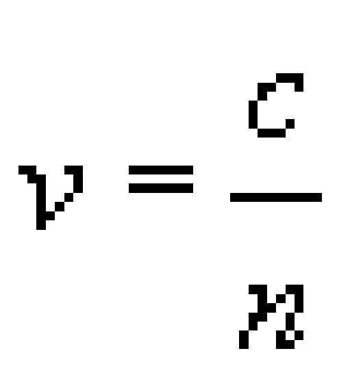

The refractive index of air is very close to 1.0 as the speed of light in air is very close to speed of light in a vacuum (free space), and the refractive index of most optical glasses is around 1.5. In optical fibre the chemical composition of the glass in the core is different from that of the cladding, so that the refractive index of the core is very slightly greater than that of the cladding.

### Experiment: Total internal reflection

You can do a simple experiment in the bath to demonstrate total internal reflection if you have a waterproof torch (or a torch you can seal in a transparent plastic bag).

You might be sceptical about doing this experiment, but I would commend it to you to reinforce the concept of total internal reflection. Please, though, remember that electricity and water can be dangerous. __Only do the experiment with a battery-powered torch.__

Fill the bath with water to a level where the torch can be fully submerged. With the room dark enough so that you can easily see where the torch beam is shining, put the torch in the water and point it towards the surface. Start at a steep angle (pointing almost directly upwards) then gradually reduce the angle, watching where the light beam goes (<a xmlns:str="http://exslt.org/strings" href="">Figure 2a</a>). Some light comes out of the water and some is reflected off the surface, but as the angle gets smaller, approaching the horizontal, you should see that the beam emerging from the water gets closer to the water surface, until eventually no light emerges at all and *all* the light is reflected back down off the surface (<a xmlns:str="http://exslt.org/strings" href="">Figure 2b</a>). This is total internal reflection, which occurs because the refractive index of water is higher than that of air.

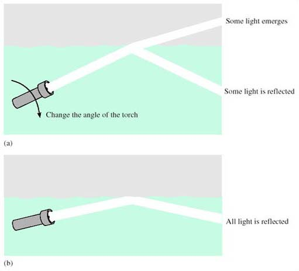

Figure 2 An experiment to demonstrate total internal reflection

For comparison, take the torch out of the water and do the experiment the other way round, shining the beam into the water. In this case you should find that although as the angle gets smaller more of the light is reflected off the water surface, some light always enters the water. You do *not* get ‘total external reflection’.

While in principle optical fibre could use the boundary between the glass and air to contain the light – like you have demonstrated using the boundary between water and air – in practice the performance is very much better when using the boundary between the core and cladding glass, which can be controlled more accurately and is protected from damage.

The basic types of optical fibre are single-mode and multimode, and are sketched in cross-section in <a xmlns:str="http://exslt.org/strings" href="">Figure 3</a>. Multimode fibre has a larger diameter core than single-mode, and, in simplistic terms, multimode fibre allows many different light paths (‘modes’) whereas single-mode allows only one. The significance of this difference will become clearer later.

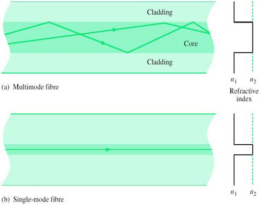

Figure 3 Single-mode and multimode optical fibres

This idea of the modes in a fibre being different paths that rays can follow is known as the ‘ray model’ of light propagation. The model is useful for a qualitative understanding of the propagation of light in fibre, and can even be used for some quantitative analysis, but a complete understanding of light in fibre requires consideration of the electromagnetic fields.

Both the fibres drawn in <a xmlns:str="http://exslt.org/strings" href="">Figure 3</a> are what is known as *step-index fibres*, because the refractive index changes from core to cladding in a single step (abruptly). An alternative construction used for multimode fibre is *graded-index* (<a xmlns:str="http://exslt.org/strings" href="">Figure 4</a>), in which the refractive index varies smoothly from a maximum down the fibre axis to a minimum in the cladding. There are advantages to using graded-index fibre rather than step-index multimode fibre which will be considered later, and the fibre used for telecommunications purposes is nearly always either single-mode fibre or graded-index multimode fibre.

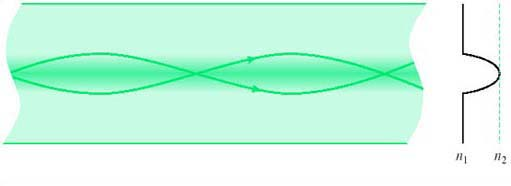

Figure 4 Graded-index multimode fibre

There are three types of fibre widely used for telecommunications (all three types have the same cladding diameter of 125 μm):

* 
Single-mode step-index fibre with a cladding diameter of 125 μm and a core of about 10 μm. Specifications for fibres of this type are to be found in IEC 60793-2-50:1992 type B1 and ITU-T G.652, G.653, G.654 and G.655 (see References).

* 
Multimode graded-index fibre with a cladding diameter of 125 μm and a core of about 50 μm. Specifications for fibres of this type are to be found in IEC 60793-2-10:1992 type A1a and ITU-T G.651.

* 
Multimode graded-index fibre with a cladding diameter of 125 μm and a core of about 62.5 μm. Specifications for fibres of this type are to be found in IEC 60793-2-10:1992 type A1b.

The IEC specifications are generally used in LANs, and the ITU-T specifications for transmission in the core network. The differences between the several ITU-T specifications for single-mode fibre are to do with their dispersion characteristics, and are discussed later in <a xmlns:str="http://exslt.org/strings" href="">Section 2.4</a>.

Broadly speaking, the 10/125 μm single-mode fibre has the highest performance but is the most difficult to use, because the small core makes joints more difficult (notice the way of describing the fibre by ‘core-diameter/cladding diameter’, such as ‘10/125 μm’. Later I shall abbreviate further, referring to ‘10 μm’ fibre). The 50/125 μm multimode fibre is easier to use but has inferior performance (higher loss and smaller usable bandwidth). The 62.5/125 μm multimode fibre is the easiest to use but has the lowest performance. The characteristics of 50/125 μm and 62.5/125 μm fibre are quite similar, however, and in practice the difference tends to be just that the former has been used in Europe and the latter in the USA.
<!--SAQ id=saq002_002-->

### SAQ 3

#### Question

These days telecommunications transmission in the core network invariably uses 10/125 μm single-mode fibre whereas LANs have mostly used one of the two multimode fibres. Why do you think this is?

#### Answer

Transmission systems in the core network need to transmit over longer distances than is needed in LANs, so the lower loss of single-mode fibre is a particular advantage, and it is worth the extra difficulty in using single-mode fibre. Because LANs do not involve such long distances, it is simpler to use multimode fibre. Note however that Gigabit Ethernet and 10 gigabit Ethernet have options for using single-mode fibre.
<!--ENDSAQ-->

## 2.3 Attenuation

### Activity 2

#### Question

At approximately what wavelength is the attenuation of optical fibre lowest? What, approximately, is the attenuation at that wavelength? What other wavelengths are used and why?

#### Answer

The attenuation of fibre is lowest in the wavelength range 1500 to 1600 nm, where it is typically around 0.2 dB km−1. This is known as the ‘1500 nm window’, or more accurately the ‘1550 nm window’. Wavelengths around 1300 nm are widely used, however, because the dispersion of standard single-mode fibre is lower around 1300 nm and because optical devices are easier to manufacture at that wavelength (and are therefore cheaper). The attenuation in the 1300 nm region is still very low, being less than 0.5 dB km −1.

Wavelengths around 850 nm are also used because devices are even cheaper at that wavelength. For short distances (such as in LANs) the higher attenuation at 850 nm is still acceptable.

In order to determine the distance achievable with a given system, a link *power budget* is calculated. I shall illustrate this with examples based on Gigabit Ethernet standards. The material that follows refers to the IEEE 802.3 standard, 2002 edition.

The Gigabit Ethernet standards describe the use of fibre in all three categories identified in the last section. Two different versions of 50/125 μm multimode fibres are specified, differing in their bandwidth. Here I am talking about the version with a bandwidth specified by the ‘bandwidth-distance product’ of 400 MHz-km. (The meaning of the bandwidth-distance product is explained later.)

The 1000BASE-SX standard (‘S’ for ‘short wavelength’) specifies operation over either 50/125 μm or 65/125 μm multimode fibres using an optical wavelength of 850 nm. Consider first operating over 50/125 μm multimode fibre and the parameters of <a xmlns:str="http://exslt.org/strings" href="">Table 1</a>, which have been selected from the IEEE 802.3 standard.
<table xmlns:str="http://exslt.org/strings">
<caption>__Table 1__: Selected parameters for 1000Base-SX operating over 50 μm multimode fibre</caption>
<tbody>
<tr>
<th>Parameter</th>
<th>Value</th>
</tr>
<tr>
<td class="highlight_" rowspan="" colspan="">Minimum launch power</td>
<td class="highlight_" rowspan="" colspan="">−9.5 dBm</td>
</tr>
<tr>
<td class="highlight_" rowspan="" colspan="">Receive sensitivity</td>
<td class="highlight_" rowspan="" colspan="">−17 dBm</td>
</tr>
<tr>
<td class="highlight_" rowspan="" colspan="">Allowance for connector and splice losses</td>
<td class="highlight_" rowspan="" colspan="">1.5 dB</td>
</tr>
<tr>
<td class="highlight_" rowspan="" colspan="">Maximum fibre attenuation</td>
<td class="highlight_" rowspan="" colspan="">3.5 dB km−1
</td>
</tr>
<tr>
<td class="highlight_" rowspan="" colspan="">Link power penalties</td>
<td class="highlight_" rowspan="" colspan="">4.1 dB</td>
</tr>
</tbody>
Reference: 

</table>

The minimum launch power and the *receive sensitivity* (the minimum power level required at the receiver) are requirements for the terminal equipment. The value for the maximum fibre attenuation is a requirement of the fibre used in the link, while the allowance for connector and splice losses and the ‘link power penalties’ are additional losses that need to be included. Several factors contribute to link power penalties, defined in paragraph 1.4.157 of IEEE 802.3 as follows:

<!--Quote id=quo001-->
>1.4.157 link penalties: For fiber optic links, the power penalties of a link not attributed to link attenuation.
>These power penalties include modal noise, relative intensity noise (RIN), intersymbol interference (ISI), mode partition noise, extinction ratio, and eye-opening penalties.

You do not need to know the details of these power penalties, but in general terms modal noise, RIN and mode partition noise are all effects due to features of the light source (in some cases also of the fibre). ‘Eye opening’ is to do with the tolerance to noise and jitter at the receiver, the concept of the data ‘eye’ coming from the appearance of the received signal when inspected with an oscilloscope.

With this information we first note that between the transmitter and receiver the maximum loss can be:

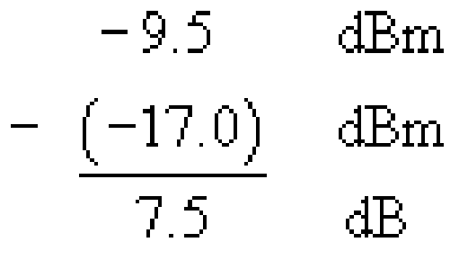

Notice that the difference between the two powers in dBm is in decibels, dB, not dBm, as it is a power ratio rather than an absolute power.

From this 7.5 dB we subtract the 1.5 dB allocated to the connectors and splices (splices are permanent joints between fibres, discussed further in <a xmlns:str="http://exslt.org/strings" href="">Section 2.6</a>) and 4.1 dB power penalties, leaving 1.9 dB for the fibre attenuation. This allows a length of 1.9/3.5=0.54 km (540 m). For this type of fibre the standard specifies an operating distance of up to 500 metres.
<!--SAQ id=saq002_003-->

### SAQ 4

#### Question

Another of the Gigabit Ethernet standards, 1000BASE-LX, is specified for use with ‘long’ wavelengths (the ‘1300 nm window’) and can be used with single-mode as well as multimode fibre (50 μm and 62.5 μm). Using the data in <a xmlns:str="http://exslt.org/strings" href="">Tables 2</a> and <a xmlns:str="http://exslt.org/strings" href="">3</a>, draw up power budgets to determine the maximum range for 1000BASE-LX systems over:

* 
(a) 50 μm multimode fibre

* 
(b) 10 μm single-mode fibre.

#### Answer

(a) For the 50 μm system, the maximum loss between the transmitter and receiver can be:

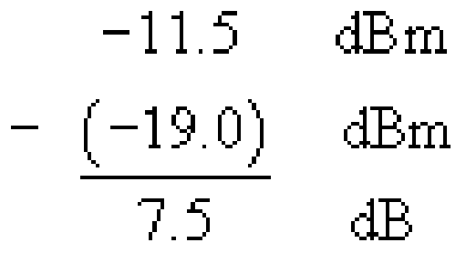

1.5 dB of this available power budget is used by the connectors and splices and 5.0 dB for link power penalties, leaving 1.0 dB for the fibre attenuation. This allows a length of not more than 1.0/1.5 = 0.67 km, or 670 m. The standard specifies an operating distance of up to 550 metres.

(b) For the 10 μm single-mode system, the maximum loss between the transmitter and receiver can be:

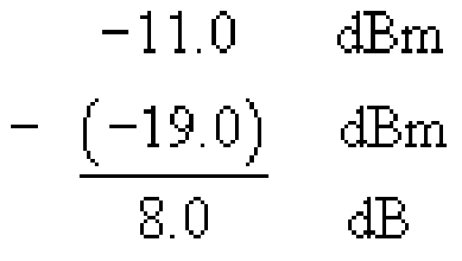

1.5 dB of this available power budget is used by the connectors and splices and 3.3 dB for link power penalties, leaving 3.2 dB for the fibre attenuation. This allows a length of 3.2/0.5 = 6.4 km. The standard specifies an operating distance of up to 5 km.
<!--ENDSAQ--><table xmlns:str="http://exslt.org/strings">
<caption>__Table 2__: Selected parameters for 1000BASE-LX operating over 50 μm multimode fibre</caption>
<tbody>
<tr>
<th>Parameter</th>
<th>Value</th>
</tr>
<tr>
<td class="highlight_" rowspan="" colspan="">Minimum launch power</td>
<td class="highlight_" rowspan="" colspan="">−11.5 dBm</td>
</tr>
<tr>
<td class="highlight_" rowspan="" colspan="">Receive sensitivity</td>
<td class="highlight_" rowspan="" colspan="">−19 dBm</td>
</tr>
<tr>
<td class="highlight_" rowspan="" colspan="">Allowance for connector and splice losses</td>
<td class="highlight_" rowspan="" colspan="">1.5 dB</td>
</tr>
<tr>
<td class="highlight_" rowspan="" colspan="">Maximum fibre attenuation</td>
<td class="highlight_" rowspan="" colspan="">l.5 dB km1
</td>
</tr>
<tr>
<td class="highlight_" rowspan="" colspan="">Link power penalties</td>
<td class="highlight_" rowspan="" colspan="">5.0 dB</td>
</tr>
</tbody>
Reference: 

</table>
<table xmlns:str="http://exslt.org/strings">
<caption>__Table 3__: Selected parameters for 1000BASE-LX operating over 10 μm single-mode fibre</caption>
<tbody>
<tr>
<th>Parameter</th>
<th>Value</th>
</tr>
<tr>
<td class="highlight_" rowspan="" colspan="">Minimum launch power</td>
<td class="highlight_" rowspan="" colspan="">−11 dBm</td>
</tr>
<tr>
<td class="highlight_" rowspan="" colspan="">Receive sensitivity</td>
<td class="highlight_" rowspan="" colspan="">−19 dBm</td>
</tr>
<tr>
<td class="highlight_" rowspan="" colspan="">Allowance for connector and splice losses</td>
<td class="highlight_" rowspan="" colspan="">1.5 dB</td>
</tr>
<tr>
<td class="highlight_" rowspan="" colspan="">Maximum fibre attenuation</td>
<td class="highlight_" rowspan="" colspan="">0.5 dB km1
</td>
</tr>
<tr>
<td class="highlight_" rowspan="" colspan="">Link power penalties</td>
<td class="highlight_" rowspan="" colspan="">3.3 dB</td>
</tr>
</tbody>
Reference: 

</table>

When referring to the wavelength of light in the context of optical-fibre communications it is the convention to refer to the wavelength that the light has in free-space.

## 2.4 Pulse spreading and bandwidth

### Activity 3

#### Question

Calculate the maximum signalling rate given by the Nyquist rate for the 1550 nm window, assuming that it runs from 1450 nm to 1610 nm.

#### Answer

Using the exact method from Section 1.2, the bandwidth is:

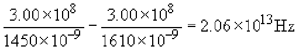

So the Nyquist rate is 4.12 ×1013 baud, or about 41 Tbaud.

This activity accurately portrays the massive *potential* capacity of optical fibre, but in practice it is not possible to exploit the full capacity directly – binary modulation at terabaud rates is a long way off!

In practice, the usable signalling rates in fibre are limited either by the speed at which the electronics at the transmitter and receiver can operate (at the time of writing, state-of-the-art commercial systems operate at up to 40 Gbaud) or by effects in the fibre that cause pulses to spread as they propagate along the fibre. Pulse spreading limits the maximum signalling rate because the more that pulses spread the more inter-symbol interference (ISI) you can get, and so the further apart in time symbols must be to prevent them interfering with each other. The amount of pulse spreading is proportional to distance – if pulses are spread by 1 ps (picosecond, 10−12 s) when travelling through 1 km of fibre then they will spread 2 ps over 2 km – so there is a trade-off between the usable bandwidth of fibre and the fibre length.

### Actvity 4

#### Question

Suppose a fibre spreads pulses at the rate of 200 ps km−1. What, approximately, is the maximum signalling rate that can be used with this fibre over a distance of: (a) 1 km, (b) 10 km?

#### Answer

Over 1 km the pulses spread by 200 ps and over 10 km they spread by 2 ns. You have to make some modelling assumptions about the pulses and at what point spreading will cause errors, but a starting point might be that the spreading must be less than half the symbol period, τ = 1/*S*, where S is the signalling rate. Over 1 km then, 0.5 × 1/*S* = 200 ps, so *S* = 0.0025 ×1012 = 2.5 Gbaud, and over 10 km we have *S* = 250 Mbaud.

A more complete analysis would take account of the fact that pulses don't remain rectangular as they spread, and that the effects are statistical – the error rate increases with increasing pulse spreading. The simple model of allowing spreading by up to half a symbol interval is adequate for order-of-magnitude considerations, however.

The main causes of pulse spreading differ between multimode and single-mode fibre, and will be considered next.

---

2.4.1 Multimode distortion
With multimode fibre, the main cause of pulses spreading is the multiple paths that signals can traverse as they travel along the fibre. This phenomenon of *multimode distortion* is illustrated in <a xmlns:str="http://exslt.org/strings" href="">Figure 5</a>.

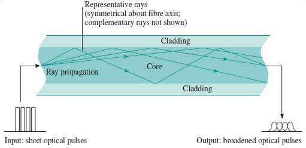

Figure 5 Multimode distortion

In the step-index fibre the light in the propagating modes is always in the core and therefore always propagating in glass with the same refractive index. The higher-order modes (the ones zig-zagging most) travel the furthest and therefore take the longest to propagate. In graded-index fibre the higher-order modes are in glass with a lower refractive index when they are off the axis. Light travels faster where the refractive index is lower, so in the graded-index fibre the light travels faster in the modes with the longer paths. This results, ideally, in the same overall propagation delay for all modes. A perfect balance is never possible, however, so there is still some pulse spreading due to multimode distortion even in graded-index fibre.

Spreading due to multimode distortion limits the usable bandwidth of a fibre. Since the amount of spreading is proportional to distance, the bandwidth is inversely proportional to distance, and the multimode distortion of a fibre is usually specified by the *bandwidth-distance product*.

Thus, for example, a 50/125 μm step-index fibre might have a bandwidth-distance product of 20 MHz·km. A 1 km fibre would have bandwidth of 20 MHz and a 2 km fibre would have a bandwidth of 10 MHz.

### Activity 5

#### Question

There are two different 50 μm graded-index multimode fibres specified for use with Gigabit Ethernet. Used with a 850 nm source, they are specified with a bandwidth-distance product of 400 MHz·km and 500 MHz·km. (The earlier discussion of power budgets considered only the first of these two.)

Given that the signalling rate of Gigabit Ethernet is 1.25 Gbaud, what will be the maximum fibre length for each of these fibres before bandwidth becomes a problem?

The signalling rate, 1.25 Gbaud, is higher than the data rate, 1 GHz, because of the line coding. The line coding is 8B10B, which means that for every 8 bits there are 10 binary symbols, so the signalling rate is greater than the data rate by a factor 10/8.

Remember that to avoid inter-symbol interference the maximum signalling rate that can be transmitted through a channel of bandwidth *B* is the Nyquist rate of 2B.

#### Answer

The minimum bandwidth is half the signalling rate, which is 625 MHz. The maximum lengths that will give this bandwidth are:

(a) the maximum distance is 400/625 = 0.64 km, or 640 m

(b) the maximum distance is 500/625 = 0.8 km, or 800 m.

In practice the bandwidth is not a sharp cut-off, and there would be some degradation to the signal for distances shorter than this. In fact, the degradation caused by multimode distortion is one of the sources of the link power penalty used in the calculation of the power budget earlier. In the Gigabit Ethernet standard the link power penalty for the 400 MHz·km fibre is 4.1 dB, but only 3.6 dB for the 500 MHz·km fibre, and the operating distance specified for the 500 MHz·km fibre is 550 m compared to 500 m for the 400 MHz·km fibre.
<!--SAQ id=saq002_004-->

### SAQ 5

#### Question

1000BASE-SX over 62.5 μm multimode fibre is also specified for two different fibre bandwidth-distance products (Table 38-12 of IEEE 802.3):

* 
(a) 160 MHz·km

* 
(b) 200 MHz·km.

What will be the maximum fibre length before bandwidth becomes a problem with each of these fibres? (Remember that the signalling rate in Gigabit Ethernet is 1.25 Gbaud.)

#### Answer

The maximum lengths that will give a bandwidth of 625 MHz are:

* 
(a) the maximum distance is 160/625 = 0.256 km, or 256 m

* 
(b) the maximum distance is 200/625 = 0.320 km, or 320 m.

The standard specifies the operating distances as 220 and 275 m respectively.
<!--ENDSAQ-->
Multimode fibre also suffers from dispersion as discussed in the following section, but multimode distortion is usually much greater than dispersion.

Note that you might sometimes see multimode distortion called multimode *dispersion*, but it is better to reserve the word ‘dispersion’ for spreading as a function of frequency, in the way described next.

---

2.4.2 Dispersion in single-mode fibre
Because there is only one mode in single-mode fibre, there is no multimode distortion but pulses are spread by dispersion.

*Dispersion* is the effect of different frequencies propagating at different speeds, and there are various mechanisms in optical fibre which mean that in general a fibre is *dispersive*. Given that dispersion takes place, a transmitted pulse will be spread because different frequency components in the pulse will take different lengths of time to propagate.

### Activity 6

#### Question

The spectrum of a modulated optical signal will always contain a range of frequencies. Why?

#### Answer

There are two reasons. First, the optical source has an inherent spectral width, as was discussed in <a xmlns:str="http://exslt.org/strings" href="">Section 2.1</a> above. Second, even assuming an ideal optical source with a single frequency (zero spectral width) the modulation will spread the spectrum.

The pulse spreading due to dispersion has the effect of limiting the bandwidth of single-mode fibre in a similar way to that in which multimode distortion limits the bandwidth of multimode fibre. Dispersion, however, is usually described explicitly by the time-spread that it imposes on a pulse, using a parameter with units ps nm−1 km−1. The ‘nm’ (nanometres) in this refers to the spectral width of the optical source and the ‘km’ (kilometres) the length of the fibre. The ‘ps’ is the time-spread in picoseconds. Thus, for example, a light-emitting diode might have a spectral width of 40 nm (for example it might contain wavelengths in the range 1300 nm to 1340 nm) so that when used with a fibre with dispersion of 15 ps nm−1 km−1 the pulse will be spread by 40 × 15 = 600 ps for every kilometre of fibre. If the system is operating at 100 Mbaud then each symbol is 10 ns long and we might expect to run into problems if pulses are spread so that they approach about half of this, 5 ns, which happens when the fibre length is

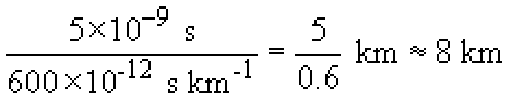
<!--SAQ id=saq002_005-->

### SAQ 6

#### Question

Laser diodes have much smaller spectral widths than LEDs. Depending upon the type of laser diode, the spectral width might be a few nanometres or much less than one nanometre. Suppose the system just described (i.e. operating at 100 Mbaud and using fibre with dispersion of 15 ps nm−1 km−1) uses a laser diode with a spectral width of 0.8 nm, how long can the fibre be in that case, before dispersion becomes a problem?

#### Answer

Pulse spreading will be 0.8 × 15 = 12 ps per kilometre, so there will be problems if the distance approaches

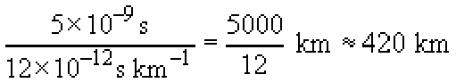
<!--ENDSAQ-->
The magnitude of dispersion in single-mode fibre varies with wavelength and in standard single-mode fibre (as specified by ITU-T G.652) the dispersion is lowest at frequencies in the 1300 nm window (it takes on the value of zero at some value in this window) and much higher (of the order of 20 ps nm−1 km1) in the 1550 nm window. When the frequencies in the 1300 nm window were used for long-distance communications (in the 1980s and early 1990s) this was very convenient, but with the advent of optical amplification by EDFAs (erbium-doped fibre amplifiers) the 1550nm window became increasingly important and the high dispersion at those wavelengths became a problem.

The use of amplifiers, furthermore, at the same time as forcing a move to the higher-dispersion 1550 nm window, actually led to a demand for lower dispersion. Previously, before amplifiers were available, transmission links contained electrical regenerative repeaters. At appropriate intervals the signal was detected, converted to an electrical signal, regenerated, then converted back to an optical signal. Because of the regeneration, the signal transmitted on each repeater segment started off ‘perfect’, and in principle you could add more and more repeater sections indefinitely. (This is not quite true because regeneration is never perfect.)

Optical amplifiers, however, amplify the signal without regenerating it. So if you replace the regenerative repeaters with EDFAs, the pulse spreading due to dispersion carries through the amplifiers, and for the link to work correctly you need to consider pulse spreading over the whole end-to-end link. Whereas previously dispersion only had to be low enough to prevent errors over the length of a repeater section, now it has to be low enough to prevent errors over the length of the whole end-to-end link.

The technology of fibre design came to the rescue, however, because new fibres were developed in which the dispersion zero was shifted to the 1550 nm window. This type of fibre is known as *dispersion-shifted fibre* (DSF), and the ITU-T have specified such a fibre in recommendation G.653.

Instead of avoiding dispersion with low-dispersion fibre, it is possible instead to ‘undo’ dispersion through the use of *dispersion compensation* techniques. The basic principle of this is that you include in the optical path some component that has the exact opposite dispersion characteristic of the fibre path (<a xmlns:str="http://exslt.org/strings" href="">Figure 6</a>).

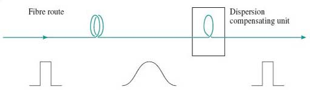

Figure 6 Dispersion compensation

In particular, it is now possible to manufacture optical fibre with reversed dispersion characteristics. Thus, for example, if the refractive index of standard fibre is higher at 1551 nm than at 1550 nm, the dispersion compensating fibre has a refractive index that is lower at 1551 nm than at 1550 nm. Dispersion compensation is complicated to implement, but it allows existing fibre (standard single-mode fibre already installed) to be used with new systems. Furthermore, as will be seen later when we discuss fibre non-linearities, there are reasons why performance can be better over a system that uses dispersion compensation instead of zero-dispersion fibre.

---

2.4.3 Polarization mode distortion
Because light is an electromagnetic wave, it has a ‘state of polarization’, which, for light in single-mode fibre, is at right angles to the path of the fibre. If you've not encountered electromagnetic waves before, all you need to appreciate is that as light travels down the fibre the electromagnetic field has an orientation across the fibre (<a xmlns:str="http://exslt.org/strings" href="">Figure 7</a>). If it helps, you can imagine the light as a beetle crawling inside a hollow fibre, and the state of polarization as the orientation of the beetle in the fibre! (<a xmlns:str="http://exslt.org/strings" href="">Figure 8</a>)

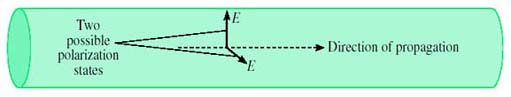

Figure 7 The polarization of light in single-mode fibre

Figure 8 The orientation of a beetle in a hollow fibre

In a perfect fibre, the state of polarization has no effect on the propagation. But fibres are not generally perfect – for example, the core might not be perfectly circular or there might be stress across the fibre. In that case the speed of propagation of the light depends on the state of polarization. For a slightly oval core, for example, the velocity of propagation will be different for light polarized in the widest direction compared to the narrowest direction. (Perhaps the beetle can crawl faster if the tube is wide and low than if it is narrow and high.)

For this imperfect fibre, it is necessary then to consider two polarization states with different velocities as two *polarization modes*. Light can travel in both modes, and because they have different velocities the existence of these two modes leads to pulse spreading and distortion, in essentially the same way as multimode distortion. (The beetle analogy is a bit stretched now. You have to imagine two beetles setting off together, one crawling across the widest direction and one across the narrowest. One beetle gets to the end before the other.)

This is known as *polarization mode distortion*, PMD. (PMD is also used as an acronym for polarization mode *dispersion*, but as explained above concerning the use of the term ‘multimode dispersion’, it is better to keep the word dispersion for effects that are frequency-dependent.)

PMD is generally very small and has only become significant as systems operating at 10 Gbit/s or 40 Gbit/s have started to appear.

## 2.5 Non-Linearity

A linear system can be defined in two ways: (1) one which obeys the principle of superposition, and (2) one possessing the frequency-preservation property.

If we consider an optical fibre with electromagnetic field as the input and output, then provided that the power level of the input signal is not too great (less than 1 mW, which is 0 dBm), the fibre may be well modelled by a linear system for most purposes.

When fibre is used for a single point-to-point link to convey a digital signal by on-off keying, it is not too serious if the fibre does not behave precisely as a linear system. When fibre is used in a more sophisticated way, however, linearity becomes important. When using wavelength division multiplexing (WDM), for example, superposition is important.

### Activity 7

#### Question

What might happen if the fibre carrying WDM signals does not behave as a linear system?

#### Answer

If superposition does not hold in the fibre, one consequence is that the presence of one signal on the fibre will affect the output of the other signal, so there will be crosstalk between the signals. There will also be new frequencies generated by the interaction between different frequencies on the fibre.

When the power levels in the fibre increase significantly above 0 dBm, nonlinear effects can become significant, and this is an important consideration in dense wavelength division multiplexing. Note that the degree of non-linearity depends upon the total power in the fibre, and adding more wavelength channels also increases the power and therefore increases the amount of non-linearity.

Dense wavelength division multiplexing, DWDM, is WDM with closely-spaced wavelengths.

Non-linearity is not always ‘bad’ however, and in fact non-linearity is exploited in optical amplifiers as discussed in <a xmlns:str="http://exslt.org/strings" href="">Section 3.3</a>.

There are several different types of non-linearity in optical fibre. You do not need to know much about them for this unit, but it is useful if you have met the names. You should appreciate that they all refer to non-linear effects in fibre, and that they become more significant at higher power levels.

In summary, the most important ones are:

* 
self-phase modulation, SPM

* 
cross-phase modulation, XPM

* 
stimulated Brillouin scattering, SBS

* 
four-wave mixing, FWM

* 
stimulated Raman scattering, SRS

Of these, *four-wave mixing* (FWM) in particular was found to have potentially serious consequences for dense wavelength division multiplexing, and stimulated Raman scattering is important because it is the process behind Raman amplifiers (discussed later).

Four-wave mixing is an effect in which light at different wavelengths interacts to generate light at another wavelength. The effect is characterised in terms of the frequencies of the waves, and in general light at four frequencies are involved: *f*1, *f*2, *f*3 and *f*new. The light with the three frequencies *f*1, *f*2 and *f*3 interact due to non-linearities in the refractive index and generate light at the new frequency, fnew where

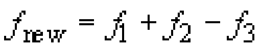

However *f*2 can be the same as *f*1 so that four-wave mixing involving only three different frequencies is possible. In this case:

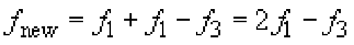

It would be misleading to call this ‘three-wave mixing’ even though there are only three frequencies involved, because the frequency relationship involves four terms. Notice that all four terms can be closely spaced (e.g. they could all be optical frequencies in the 1550 nm window). If you had only three terms, one of the frequencies would have to be substantially different from the other two. Thus if *f*new = *f*1 − *f*3 and *f*1 is close to *f*3, then *f*new is much smaller than either of *f*1 or *f*3. This effect, where a new, much lower, frequency is generated by the difference between two closely-spaced frequencies, is called beating. Beating can be a problem at receivers where two closely-spaced optical signals can generate a new electrical signal at the beat frequency. I do not wish to consider beating any further, however, and return now to the discussion of four-wave mixing.

Four-wave mixing is damaging to DWDM signals for two reasons: it attenuates the signals and it introduces new signals which can cause interference.

For FWM to be significant in fibre it is necessary for the phase relationship between the various light signals to remain constant over long distances. This occurs if the dispersion is low, so, ironically, FWM in the 1550 nm window is worse in G.653 dispersion-shifted fibre than in standard G.652 fibre.

### Activity 8

#### Question

There was another way of reducing the effects of dispersion – an alternative to using fibre with a low dispersion coefficient – that was described earlier. What was it?

#### Answer

It is possible to use dispersion compensation.

It is possible therefore to reduce pulse spreading due to dispersion as well as avoiding the problems of FWM by using standard single-mode fibre combined with dispersion compensation.

A solution which avoids the need for dispersion compensation is to use fibre which has low but not zero dispersion in the 1550 nm widow. This is the reason for another single-mode fibre specified by the ITU-T G.655 standard – *non-zero dispersion-shifted fibre* (NZ-DSF).

Raman scattering (C. V. Raman, Indian physicist (1888–1970)) is a process in which light is scattered by the material through which it propagates, but in the process it changes its wavelength – specifically, the wavelength gets longer. In stimulated Raman scattering (SRS) light at the longer wavelength is already present in the medium, and increases (stimulates) the scattering. The ‘pump’ light is injected at the amplifier to provide a source of power for the amplification process. This is considered further in <a xmlns:str="http://exslt.org/strings" href="">Section 3.3</a>. In fibres carrying DWDM, SRS has the effect of transferring power from channels at shorter wavelengths to channels at longer wavelengths.
<!--SAQ id=saq002_006-->

### SAQ 7

#### Question

What is dispersion-shifted fibre, and why has it become necessary in recent years when standard single-mode fibre was previously considered adequate?

Under what conditions is non-zero dispersion-shifted fibre preferable to dispersion-shifted fibre?

#### Answer

Standard single-mode fibre has the minimum dispersion in the 1300 nm transmission window. Dispersion-shifted fibre has the dispersion minimum shifted to the 1550 nm window.

Dispersion limits the bandwidth of single-mode fibre, so for high signalling rates low dispersion is required. The highest signalling rates can therefore be used at the wavelengths near the dispersion minimum.

Previously, the wavelengths used for transmission were in the 1300 nm window, which is therefore compatible with high signalling rates on standard single-mode fibre.

More recently the 1550 nm window has been used instead, because erbium-doped fibre amplifiers have been developed and these only operate around 1550 nm. Using standard single-mode fibre the higher dispersion would significantly limit the signalling rate at 1550 nm, so dispersion-shifted fibre is used instead.

Although low dispersion is desirable to minimise pulse spreading, it can increase the problems caused by non-linear effects in the fibre. In particular, when dense wavelength division multiplexing (DWDM) is used on a fibre, four-wave mixing (FWM) can be a significant problem if the dispersion is very low. DWDM uses the 1550 nm window, so the requirement for higher dispersion to reduce FWM can be achieved by going back to using standard single-mode fibre. The problem of high dispersion then returns, but that can be overcome through the use of dispersion compensation.

Dispersion compensation is complex to implement, so an alternative, preferable, solution is to use non-zero dispersion-shifted fibre. This has low enough dispersion in the 1550 nm window to allow high signalling rates without the need for dispersion compensation, but the dispersion is high enough to prevent problems with FWM.
<!--ENDSAQ-->

## 2.6 Connecting and splicing fibres

There are two different types of fibre joint that need to be considered: permanent *splices* (the equivalent of soldered or crimped connections on copper cables) and demountable *connectors*.

Splices are used along a route to allow a link to be built up from convenient lengths of cable. The lengths are typically 2 km. Fibre is manufactured in lengths longer than this, but, once put in a cable, lengths longer than 2 km are difficult to transport and lay. Splices are also used to repair breaks in fibres. Connectors are used at the interface of equipment (such as a repeater, amplifier or terminal) to the cable.

The basic aim of a fibre joint (splice or connector) is to allow light to pass from the core of one fibre to another, with as little loss or reflection as possible. This is made more difficult by the difficulty of aligning the two fibres accurately, given the small size of the core.

There are two classes of problem which lead to loss through a joint (referred to as *insertion loss*):

* 
Those resulting from differences between two fibres being joined, possibly because of imperfections in the fibres (variations in core or cladding refractive indices, core or cladding diameters, ellipticity, eccentricity of core and cladding), see <a xmlns:str="http://exslt.org/strings" href="">Figure 9</a>.

* 
Those resulting from alignment error (gaps, offsets and angular misalignments of otherwise perfect fibres), see <a xmlns:str="http://exslt.org/strings" href="">Figure 10</a>. Because of the smaller core size, all of the above problems are more serious for single-mode than for multimode fibre.

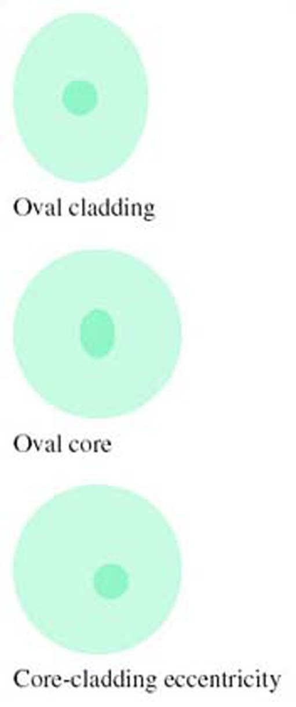

Figure 9 Fibre imperfections (much exaggerated)

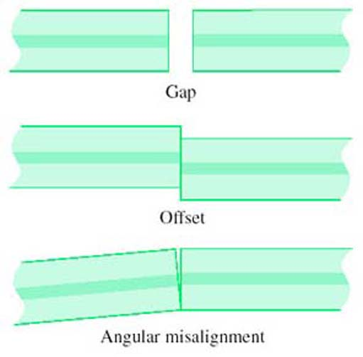

Figure 10 Alignment errors

It might seem that, since the critical feature of a joint is aligning the cores, features of the cladding such as ellipticity or different diameters are unimportant, but this is not generally so. Most joints rely on using the outside surface of the fibre for alignment, so errors in the cladding can be transferred to a core misalignment. A method of alignment which avoids this problem is discussed in the section on splicing below.

As well as insertion loss, reflections at connectors can be a problem. Any sort of discontinuity in a fibre can result in some light being reflected back towards the source, so most connectors cause some reflection. (Splices can also cause reflection, but usually to a lesser degree.) In particular, if there is a gap between the ends of the fibres the abrupt change in refractive index between the glass and the air in the gap causes a reflection referred to as *Fresnel reflection*. From optical theory it can be shown that a step change in refractive index from *n*1 to *n*2 causes a fraction, *r*, of the light power to be reflected, where *r* is given by:

The refractive index of fibre used in communications-grade optical fibre is around 1.5, and the refractive index of air is about 1.0, so the Fresnel reflection between the fibre and the air is:

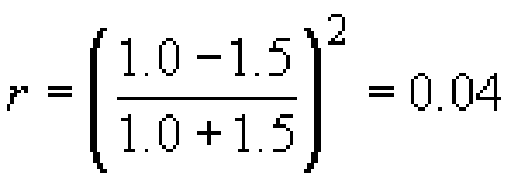

So around 4% of the light power will be reflected when the light enters the air gap, and 96% will enter the gap, <a xmlns:str="http://exslt.org/strings" href="">Figure 11</a>.

Figure 11 Reflections at a gap in fibre connection

### Activity 9

#### Question

How much light will be reflected when the light enters the fibre at the end of the air gap?

#### Answer

The same fraction is reflected on leaving the gap as entering: 4%. This is 4% of the 96% that entered the gap, which is 0.04 × 0.96 × 100 ≈ 3.8% of the original light power (see <a xmlns:str="http://exslt.org/strings" href="">Figure 11</a>).

### Activity 10

#### Question

What, in dB, is the total insertion loss due to the two reflections?

#### Answer

The light power getting through to the far side of the gap is 0.96 × 0.96 × 100 ≈ 92.2%. In dB this, the insertion loss, is given by −10 log 0.922 = 0.35 dB.

### Activity 11

#### Question

What, in dB, is the ratio between the incoming power and the reflected power (the *return loss*)?

#### Answer

The total reflected power is 4 + 3.8 = 7.8% of the original power, so the return loss in dB is −10 log 0.078 = 11.1 dB.

This calculation neglects light paths that involve more than one reflection. These losses will be very small. (The power after two reflections is 0.04 × 0.04 × 100 = 0.16%.)

Reflection will only occur in this way if the gap is much bigger than the wavelength of the light being conveyed. If the gap is much smaller than the wavelength there will be little or no reflection. If the gap is similar in size to the wavelength then the nature of the reflection is complicated by interference effects and the amount of reflection depends upon the precise dimensions.

Reflected light can lead to increased noise on the signal from two effects. First, some lasers are sensitive to reflected light and become noisy or unstable when too much light is reflected back into them. Second, a double reflection (<a xmlns:str="http://exslt.org/strings" href="">Figure 12</a>) results in a delayed copy of the transmitted signal reaching the receiver. This delayed signal can result in an apparently disproportionately large amount of noise due to interference effects between the direct and reflected optical fields. Reflections are not normally a problem with splices, but techniques to minimise reflections have influenced changes in connector designs, as discussed influenced changes in connector designs, as discussed below.

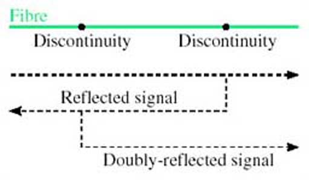

Figure 12 Double reflection

<!--SAQ id=saq002_007-->

### SAQ 8

#### Question

Suppose water intruded into the gap between two fibres. What fraction of power would be returned due to Fresnel reflections in that case? (Assume that the refractive index of water is 1.3.)

#### Answer

Using:

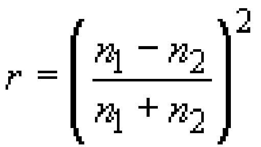

with *n*1 = 1.5 and *n*2 = 1.3 gives *r* = (0.2/2.8)2 = 0.0051, which is about 0.5%. This is the reflection from each surface (entering and leaving the gap), so the total reflection is about 1%.
<!--ENDSAQ-->
The SAQ shows that the amount of reflection can be reduced by the presence in the gap of a material with refractive index close to that of glass. In practice water would not be used to do this – it would evaporate, for one thing. There are circumstance, however, where a special fluid or gel is used in the gap, which is designed to have the same refractive index as the glass and does not evaporate. This is *index-matching fluid* or *index-matching gel*.

---

2.6.1 Connectors
Many techniques have been used to design connectors that align the fibre ends accurately with high reliability and a long lifetime. The development of such components, at a low enough price, has been an important part of the overall development which has made fibre a feasible proposition for commercial transmission systems.

With fibre attenuation down to 0.2 dB km−1 (for single-mode fibre), the losses resulting from connectors and splices can be very significant over a whole route.

### Activity 12

#### Question

What length of fibre would have the same loss as the insertion loss due to the Fresnel reflections (0.35 dB) in a connector containing an air gap?

#### Answer

At 0.2 dB km−1, the loss due to the two Fresnel reflections in the connector is equivalent to 0.35/0.2 = 1.75 km of fibre.

<a xmlns:str="http://exslt.org/strings" href="">Figure 13</a> illustrates one type of connector, known as a ferrule connector (or FC connector).

Figure 13 Ferrule connector (note that this diagram is based on the industry-standard ‘FC connector’, but is not drawn as an exact representation)

In the basic connector the ends of the fibre are polished flat. In principle the two fibre ends could then abut, but any roughness on the surface (<a xmlns:str="http://exslt.org/strings" href="">Figure 14</a>), any dust on the fibre ends or any slight angular misalignment (<a xmlns:str="http://exslt.org/strings" href="">Figure 10</a>) will leave a gap between the cores. As noted above, if the gap is much less than the wavelength of the light being conveyed there is no problem, but since the wavelength is around 1.3 μm, this is a difficult target to meet.

Gap caused by rough fibre end-faces

Instead of polishing the ends flat, therefore, the ‘PC’ (*physical contact*) *ferrule connector* has the ends of the fibres polished to give two convex surfaces, resulting in better contact for the cores (<a xmlns:str="http://exslt.org/strings" href="">Figure 15</a>).

Figure 15 End faces polished for physical contact

Even with the PC arrangement there is generally some residual reflection, and to minimise the reflections even further there is the *angle-polished convex* (APC) finish (<a xmlns:str="http://exslt.org/strings" href="">Figure 16</a>). (APC is sometimes taken to mean angled physical contact, but it still refers to the same method.) In this case the end-faces are polished at an angle, so that most of any light that is reflected is at an angle that is not guided by the fibre.

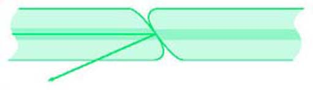

Figure 16 Angle-polished convex (APC) end-faces

In general terms, PC connectors have the lowest insertion loss, whereas APC connectors have the lowest back reflections (APC is sometimes taken to mean angled physical contact, but it still refers to the same method.)

---

2.6.2 Splicing
The usual technique for splicing in the field is electric arc fusion splicing. This involves aligning the two fibre ends and then fusing them with an electric arc.

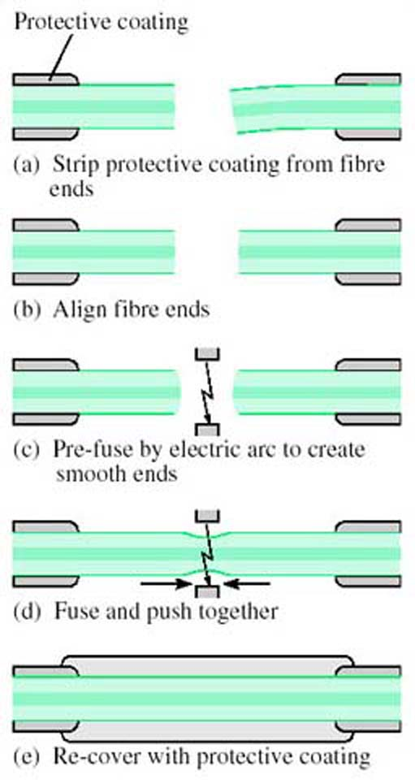

Figure 17 Electric arc fusion splicing

Specially designed jigs are used for this purpose, and the steps involved are as shown in <a xmlns:str="http://exslt.org/strings" href="">Figure 17</a>:

* 
(a) Strip all protective coating from the fibre ends.

* 
(b) Place the fibres on the jig and align the ends using a microscope.

* 
(c) Pre-fuse the fibre ends to give a smooth surface.

* 
(d) Bring the fibres together and fuse.

* 
(e) Re-cover the stretch of bare fibre with a protective coating.

To avoid relying on the outside surface of the fibre for alignment, a technique is used in some jigs based upon shining light through the two fibres while they are being aligned. The best alignment is indicated by the lowest loss. Light injection and extraction is done (all within the jig) by bending the fibres beyond the point at which light is guided (<a xmlns:str="http://exslt.org/strings" href="">Figure 18</a>) – but not so far as to risk damaging the fibre.

__Figure 18__: Fibre alignment by local injection of light

## 2.7 Cabling

A distinction must be made between the optical fibre – a single strand of glass fibre – and the optical-fibre cable consisting of one or more strands of fibre and various protective coverings.

Bare optical fibre is fragile and vulnerable, and the cabling must provide the properties given below.

* 
*Tensile strength*: The cable should prevent the fibre being strained when the cable is under tension. When the cable is being laid, for example, pulling it through a duct results in considerable tension.

* 
*Abrasion resistance*: Abrasion on the surface of the fibre will weaken it significantly because cracks, starting at surface scratches, will readily propagate right across the fibre. The cable around the fibre must protect it from such abrasion.

* 
*Resistance to radial compression*: There must be sufficient radial strength in the cable to shield the fibre from the expected radial force.

* 
*Bend resistance*: If the fibre is bent such that its radius of curvature is less than a critical minimum, its attenuation starts to increase as a result of light loss. The cable must ensure that the fibre is never bent that severely.

* 
*Environmental protection (chemical resistance)*: Certain chemicals can react with the glass of the fibre to change its optical properties. For example, hydrogen can increase the attenuation. The cable must prevent such chemicals coming into contact with the fibre.

These are the principal characteristics required of the cable, but there are other hazards against which the fibre must be protected in particular circumstances. For example, frequent vibration or flexing of the fibre could weaken it so that it eventually breaks.

The first stage of protection of the fibre is the addition of one or more polymer layers as soon as the fibre is manufactured, before it is wound onto a drum. This is necessary to protect against abrasion, which can very easily damage the bare fibre. The polymer-coated fibre is then cabled to provide various degrees of protection depending upon the application. At one extreme the cabling could be just further plastic covering to produce a cable for use within a rack of equipment. At the other extreme many fibres could be put together in an armoured cable for use in a submarine optical-fibre link.

