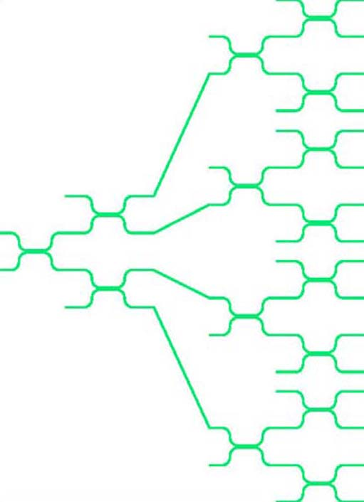
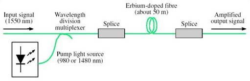
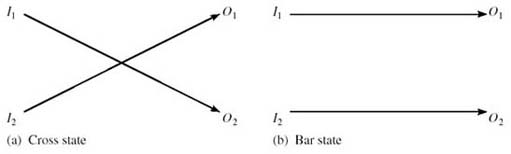
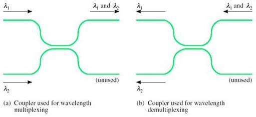
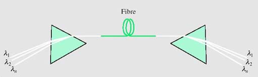

# 3 Optical components

## 3.1 Introduction

The basic optical-fibre link consisted of the source (laser or LED), the fibre and the detector, as was shown in <a xmlns:str="http://exslt.org/strings" href="">Figure 1</a>. Improvements in these components can increase the data rate, but the system is still a point-to-point transmission link and all signal processing, such as routeing, switching and regeneration, is done in electronics.

With the availability of devices that can process optical signals directly comes the possibility of using fibre in a more sophisticated way, leading eventually to an *all-optical network*.

This section considers some of the technology used and the components that have been created which might form the building-blocks of an optical network – or at least allow fibre to be used for slightly more than a point-to-point transmission link.

## 3.2 Directional couplers

A simple yet valuable device is the *directional coupler* (<a xmlns:str="http://exslt.org/strings" href="">Figure 19</a>). A directional coupler can be constructed from two single-mode fibres by bringing them into close contact and heating so that the glass melts and the two fibres fuse. Light can then pass from one fibre to the other.

A directional coupler constructed from fibres in this way is known as *a fused fibre coupler*.

Figure 19 A directional coupler

Depending upon the details of the way directional couplers are made – how long the fused section is, how closely joined the fibres are – they can be made to have different properties for different purposes. For example, a ‘3 dB coupler’ is designed so that light entering from one fibre splits equally to the two fibres at the output.

### Activity 13

#### Question

Why do you think this is called a 3 dB coupler? Think about the ratio between the input and output power.

#### Answer

Since the input is split equally between the two outputs, the power on each of the outputs is half that at the input (assuming an ideal device). In decibels, the ratio between the input power and the output power is therefore 10 log(2) = 3 dB.

The question assumed an ideal component. Real optical components invariably have additional loss due to imperfections. This is called the *excess loss*. The overall ratio between the input and output power, expressed in decibels, is the insertion loss.

Another factor that might need to be considered in a real 3 dB coupler is the asymmetry between the two outputs, because the splitting might not be exactly equal between the two.

### Activity 14

#### Question

Suppose a nominally 3 dB coupler has an excess loss of 0.1 dB. What is its insertion loss?

#### Answer

The insertion loss is just the nominal loss plus the excess loss, 3.1 dB.

For some applications multi-way tree and star topologies are useful in fibre systems. Multi-way *splitters* and *combiners* (for the tree topology) and *star couplers* can be built from concatenated directional couplers as shown in <a xmlns:str="http://exslt.org/strings" href="">Figure 20</a>. Assuming the directional couplers are 3 dB couplers, the configuration in <a xmlns:str="http://exslt.org/strings" href="">Figure 20(a)</a> splits light equally to each of the four outputs. In the configuration in <a xmlns:str="http://exslt.org/strings" href="">Figure 20(b)</a> light on each of the four inputs is split equally to all of the four outputs – so the outputs each have light from all of the four inputs. Directional couplers work in both directions; so, for example, the splitter can also be used as a combiner. In <a xmlns:str="http://exslt.org/strings" href="">Figure 20(a)</a> one-quarter of the light entering any of the ‘outputs’ will reach the input. (It is only one-quarter, because the rest of the light goes to the fibres labelled ‘unused’.)

Splitters and star couplers constructed from directional couplers

<!--SAQ id=saq003_001-->

### SAQ 9

#### Question

Suppose a splitter is built from 3 dB couplers to distribute light to 16 outputs, and that each of the couplers has an excess loss of 0.2 dB. If the power on the input is −4 dBm, what is the power on each of the outputs expressed both in dBm and milliwatts?

#### Answer

Each coupler introduces a loss of 3.2 dB. The light has to pass through four couplers to get to an output (see Figure 21), so the loss is

4 × 3.2 = 12.8 dB

The power on the output is therefore

−4 − 12.8 = −16.8 dBm

This is 10−1.68 = 0.0209 mW, or about 21 μW.

As a check that this is about right, the power on the input is −4 dBm which is 10−0.4 = 0.4 mW. If the splitters were perfect this would be split equally 16 ways, so that the power on each output would be 0.4/16 = 0.025 mW. The excess loss reduces this to 0.021 mW.

Figure 21

<!--ENDSAQ-->
In general, the properties of a directional coupler depend upon wavelength, and this can be useful. For example, a device can be constructed to combine or split two wavelengths, to perform wavelength division multiplexing.

## 3.3 Optical amplifiers

<a xmlns:str="http://exslt.org/strings" href="">Figure 22</a> shows in outline one possible structure for an Erbium-doped fibre amplifier (EDFA).

Erbium-doped fibre amplifier

A length of erbium-doped fibre is spliced in line with the fibre carrying the signal, and high-power, unmodulated light at a specific, shorter, wavelength (the ‘pump’ wavelength) is coupled into the same fibre. The erbium-doped fibre has the same physical structure as standard single-mode fibre but the glass it is made of has erbium atoms added (it is ‘doped’ with erbium), and the presence of the erbium has the effect of transferring energy from light at the pump wavelength to the signal wavelength. In this way the (modulated) signal at around 1550 nm emerges from the erbium-doped fibre at a higher power, having taken the power from the pump.

The wavelength of the light used for the pump can be either 980 nm or 1480 nm. Sometimes both pump wavelengths are used simultaneously to get maximum gain.

While EDFAs are simple in principle and have had a dramatic effect on optical-fibre communications, there are a number of considerations that must be taken into account when they are used, including:

* 
*Cost*: Both the wavelengths used in the pump source are difficult to generate and the lasers used to produce them are expensive.

* 
*Noise*: In addition to amplifying the input signal, EDFAs (like all amplifiers) also generate a noise signal, in this case known as amplified spontaneous emission (ASE).

* 
*Gain-flatness*: In an ideal amplifier a plot of gain against wavelength would be flat across the range of wavelengths for which it is to be used. In a real amplifier the gain depends to some extent upon the precise input wavelength. This can be a problem in systems carrying WDM (wavelength division multiplexed) signals since some wavelengths will be amplified more than others.

In addition, as already explained, EDFAs only work in the 1550 nm window.

Other technologies are available for manufacturing optical amplifiers. For example, *semiconductor optical amplifiers* (SOAs), also called semiconductor laser amplifiers (SLAs), can be made for use in both the 1550 nm and 1300 nm windows. They use the same technology as the laser diodes that provide the light source at the transmitter, but have a different physical structure. Although SOAs have been available for some time and are potentially cheaper than EDFAs, their performance is not as attractive as EDFAs and they have not been very widely used.

At the time of writing *Raman amplifiers* have just started to appear commercially. Raman amplifiers use *stimulated Raman scattering* (SRS) to transfer power from light at a pump wavelength to the signal. This effect is similar to what happens in an EDFA, but is caused by a different physical property leading to different characteristics. Whereas EDFAs transfer power from one or both of two specific pump wavelengths to a specific range of signal wavelengths, with SRS the importance lies in the difference between the pump wavelength and the signal wavelength. For both the 1300 and 1550 nm windows a pump at any wavelength will amplify light with a wavelength about 100 nm longer. Thus if you want to amplify light at, say, 1330 nm you need a pump with a wavelength of about 1230 nm. By having several pumps at different wavelengths, it is possible to amplify over a large range of signal wavelengths.

When considering optical amplifiers it is convenient to refer to the frequency ranges available for optical-fibre transmission defined by Ramaswami and Sivarajan (2002):
<table xmlns:str="http://exslt.org/strings">
<caption>Table 4</caption>
<tbody>
<tr>
<td class="highlight_" rowspan="" colspan="">O band</td>
<td class="highlight_" rowspan="" colspan="">(O for ‘original’ wavelength band)</td>
<td class="highlight_" rowspan="" colspan="">1260–1360 nm</td>
</tr>
<tr>
<td class="highlight_" rowspan="" colspan="">E band</td>
<td class="highlight_" rowspan="" colspan="">(E for ‘extended’ wavelength band)</td>
<td class="highlight_" rowspan="" colspan="">1360–1460 nm</td>
</tr>
<tr>
<td class="highlight_" rowspan="" colspan="">S Band</td>
<td class="highlight_" rowspan="" colspan="">(S for ‘short’ wavelength band)</td>
<td class="highlight_" rowspan="" colspan="">1460–1530 nm</td>
</tr>
<tr>
<td class="highlight_" rowspan="" colspan="">C Band</td>
<td class="highlight_" rowspan="" colspan="">(C for ‘conventional’ wavelength band)</td>
<td class="highlight_" rowspan="" colspan="">1530–1565 nm</td>
</tr>
<tr>
<td class="highlight_" rowspan="" colspan="">L Band</td>
<td class="highlight_" rowspan="" colspan="">(L for.‘long’ wavelength band)</td>
<td class="highlight_" rowspan="" colspan="">1565–1625 nm</td>
</tr>
<tr>
<td class="highlight_" rowspan="" colspan="">U band</td>
<td class="highlight_" rowspan="" colspan="">(U for ‘ultra-long’ wavelength band)</td>
<td class="highlight_" rowspan="" colspan="">1625–1675 nm</td>
</tr>
</tbody>
Reference: 

</table>
<!--SAQ id=saq003_002-->

### SAQ 10

#### Question

What technologies can be used to amplify optical signals in the following bands?

* 
(a) O band

* 
(b) C band.

#### Answer

* 
(a) Semiconductor optical amplifiers (SOAs) and Raman amplifiers can be used in the O band.

* 
(b) Semiconductor optical amplifiers and Raman amplifiers can also be used in the C band, but additionally erbium-doped fibre amplifiers (EDFAs) can be used at these wavelengths.

<!--ENDSAQ-->

## 3.4 Optical switches

Optical space switching has been possible for a long time, but has been slow to find widespread application.

Solid-state optical switching (i.e. switching with no moving parts) can use devices based upon electro-optic materials such as *lithium niobate* (LiNbO3). An *electro-optic material* is one whose refractive index changes significantly when an electric field is applied across it.

<a xmlns:str="http://exslt.org/strings" href="">Figure 23</a> shows a 2 × 2 switch element which exploits the electro-optic effect. This is a coupler, similar to those previously described, but in the coupling region the light travels in an electro-optic material such as lithium niobate instead of glass. When an electric field is applied across one or both of the light paths, the amount of light crossing between the two paths changes.

Figure 23 A 2 × 2 optical switch based upon a directional coupler

With suitable design, it can be arranged to switch between the ‘cross’ state (light entering *I*1 emerges from *O*2, and light entering *I*2 emerges from *O*1, as in <a xmlns:str="http://exslt.org/strings" href="">Figure 24(a)</a> and the ‘bar’ state (light entering *I*1 emerges from *O*1 and light entering *I*2 emerges from *O*2, as in <a xmlns:str="http://exslt.org/strings" href="">Figure 24(b)</a> under the control of the applied voltage, *V*.

The states of a 2×2 optical switch

Electro-optic switches such as these can be operated at high speed – switching between the two states can be as fast as 10 ps – but they are expensive, they generally introduce high losses in the optical signal (up to 8 dB) and can introduce distortion in the transmitted signal due to polarization effects.

A more recent development is the micro-electro-mechanical system switch. *Micro-electro-mechanical systems* (MEMS) are miniature electrically operated mechanical devices which can be constructed using the same materials and similar processing techniques as for large scale integrated electronic components. For optical switching, miniature movable mirrors can be made, each with dimensions of less than a millimetre. The movement of the mirrors can be controlled by an electrical signal, and incoming light beams from optical fibres can be directed to one of several different output fibres to perform the switching function.

With this technology, compact switching arrays with large numbers of crosspoints can be constructed as illustrated in <a xmlns:str="http://exslt.org/strings" href="">Figure 25</a>.

Figure 25 A space switch using MEMS technology

Two arrays of mirrors are used, one associated with the input fibres and one with the output fibres. Each of the mirrors on the input array can deflect the input beam to any of the mirrors on the output array. To switch from input fibre *i* to output fibre *j*, the mirror *i* on the input array deflects the beam from input fibre *i* to mirror *j* on the output array. Mirror *j* then deflects this beam to output fibre *j*.

<a xmlns:str="http://exslt.org/strings" href="">Figure 25</a> shows a line of input and output fibres, but this is only to simplify the illustration. In practice the fibres (and mirrors) are in rectangular arrays, allowing more fibres to be packed into a small structure. They can be constructed with large arrays of crosspoints – typically 32 × 32 or 64 × 64 arrays, but up to 1000 × 1000.

Compared to switches based upon electro-optic materials, MEMS switches are slow (switching times of the order of 10 ms) but introduce less attenuation (of the order of 5 dB).

Because of the importance of optical switching, there has been a lot of research effort put into investigating different switch technologies, and the two presented here represent two extremes: fast, small arrays in the case of lithium niobate electro-optic switches and slow, large arrays in the case of MEMS switches. Lithium niobate electro-optic switches have been available for many years but have not yet been used commercially to any great extent. MEMS switches on the other hand have only been developed recently (2002) and are already starting to be exploited commercially.

## 3.5 Wavelength multiplexing and demultiplexing

Wavelength multiplexers and demultiplexers are needed in order to be able to use wavelength division multiplexing. With just two wavelengths, the multiplexers and demultiplexers can be based on directional couplers because, as mentioned earlier in <a xmlns:str="http://exslt.org/strings" href="">Section 3.2</a>, couplers are naturally wavelength-dependent and with appropriate design can be arranged to split and combine two chosen wavelengths. As shown in <a xmlns:str="http://exslt.org/strings" href="">Figure 26</a>, and using the language of a 2 × 2 switch (<a xmlns:str="http://exslt.org/strings" href="">Figure 24</a>), the coupler is in the ‘cross’ (over) state for λ2 and the ‘bar’ (non cross-over) state for λ1.

Figure 26 Wavelength multiplexing and demultiplexing with a directional coupler

With *dense wavelength division multiplexing* (DWDM) forty or more wavelengths can share a single fibre.

A number of different technologies have been developed for multiplexing and demultiplexing multiple wavelengths, but the principle is illustrated by a prism, as shown in <a xmlns:str="http://exslt.org/strings" href="">Figure 27</a>. You are probably familiar with the way in which a prism splits white light into its constituent colours (the rainbow effect), so the principle can be used to separate the different wavelengths in the beam emerging from a fibre carrying a DWDM signal.

Figure 27 Using prisms for wavelength multiplexing and demultiplexing

Used in reverse, a prism can combine the different wavelengths into a single DWDM beam. Wavelength division multiplexers and demultiplexers based upon prisms can be used in practice for DWDM, but not quite as drawn in <a xmlns:str="http://exslt.org/strings" href="">Figure 27</a> because lenses are required to couple the light into and out of the fibres.
<!--SAQ id=saq003_003-->

### SAQ 11

#### Question

Identify three uses of devices based upon directional couplers.

#### Answer

Three uses of devices based upon directional couplers:

1. 
Power splitting, such as for a tree topology

2. 
Constructed with electro-optical material, they can be used for switching

3. 
They can also be designed so that the splitting is wavelength-dependent so that they can be used as wavelength division multiplexers or demultiplexers.

<!--ENDSAQ-->
