# 4 Developments and future directions in optical-fibre communications

## 4.1 Introduction

*Additional material for this unit, by David Chapman, January 2005*

The start of optical-fibre communication is generally identified with a paper published in 1966 (Kao and Hockham, 1966). It was not until about ten years later that it was commercially viable, but from then on there was more or less continuous development, with substantial research effort taking place both in industry and universities.

Innovation continues today, and this additional material introduces some of the fields of development that are being pursued now.

A good overview of the history of optical-fibre communications in the UK can be found in a paper by Professor Midwinter of University College London, published in the ‘Millennium Issue’ of the *IEEE Journal on Selected Topics in Quantum Electronics* (Midwinter, 2000).

### Coherent optical communications: a cul-de-sac?

In the 1980s, a lot of research effort was expended on developing a technique known as ‘coherent detection’ of optical signals. The technique involved applying to optical signals a method that is widely used in the detection of radio signals, but that is much more difficult to do with optical signals because of the very much higher frequency of light (of the order of 10 Hz) compared to radio (under 10 Hz). Coherent detection provides a way of building receivers with very high sensitivity, and might also be used to allow closer channel spacing in wavelength division multiplexed signals.

Previously, I wrote:

<!--Quote id=quo001_001-->
>At the time of writing (1988), although coherent detection has been demonstrated in many impressive experiments, it still requires further development before it will be suitable for use in commercial optical systems

and

<!--Quote id=quo001_002-->
>Full exploitation of the capabilities of optical fibre can be achieved by the use of … coherent detection.

As I write now, 18 years later, commercial deployment of coherent detection has still not taken place, and the research effort has tailed off. To a large extent, interest in coherent optical techniques waned with the development of erbium-doped fibre amplifiers (EDFAs). The main attraction, in the short term at least, of coherent detection was the very high receive sensitivity that it gave, which in turn was desirable because it allowed longer transmission distances between repeaters. Optical amplifiers provided the same benefit (long repeater spacing), and it turned out that EDFAs were much simpler to use than coherent optical detection. The use of coherent techniques in wavelength division multiplexing might still be valuable one day, but for the present other, simpler, technologies are sufficient and coherent optical techniques looks like a research avenue that turned into a cul-de-sac.

## 4.2 Fibre in the core network

All new trunk transmission – that is, transmission between telephone exchanges – is now over optical fibre. Mostly it uses either PDH or SDH links. Year by year the data rates have increased, so that at the time of writing STM-64 products are available commercially.
<!--SAQ id=saq004_001-->

### SAQ 12

#### Question

What, approximately, is the bit-rate of an STM-64? What is the bit-rate of the next stage to be developed?

Although STM-256 systems are expected to be available soon, there are difficulties with operating them on currently installed fibre, and there are doubts that the trend of ever-higher time-division multiplexed rates will continue indefinitely.

#### Answer

An STM-64 will run at approximately 64 × 155.52 = 9953 Mbit/s, which is about 10 Gbit/s.

The SDH hierarchy increases by factors of 4, so the next stage is STM-256, at approximately 40 Gbit/s.
<!--ENDSAQ-->

### Activity 15

#### Question

What are the problems with operating at ever higher data rates over single-mode fibre?

#### Discussion

As the data rates increase the tolerance to pulse-spreading decreases. At 40 Gbit/s, on single-mode fibre, dispersion and polarization-mode distortion significantly limit the transmission distance. (Multimode fibre could only be used for very short distance because of multimode distortion.)

The solution being used for increasing further the capacity of fibre is therefore wavelength division multiplexing, WDM.

In Recommendation G.671 the ITU-T identified three categories of WDM, defined by the spacing between the channels as follows:

You will see later that wide WDM, WWDM, is used to mean something rather different in the standard for 10 Gigabit Ethernet.

<!--Quote id=quo001_003-->
>__3.1.14.1 Coarse WDM (CWDM) device__
>A class of WDM devices having a channel wavelength spacing less than 50 nm but greater than 1000 GHz (about [*X*] nm at 1550 nm and [*Y*] nm at 1310 nm). Devices within this class can cover several spectral bands.
>__3.1.14.2 Dense WDM (DWDM) device__
>A class of WDM devices having a channel spacing less than or equal to 1000 GHz. Devices within this class can cover one or more spectral bands.
>__3.1.14.3 Wide WDM (WWDM) device__
>A class of WDM devices having a channel wavelength spacing greater than or equal to 50 nm. This device class typically separates a channel in one conventional transmission window (e.g. 1310 nm) from another (e.g. 1550 nm).

The mixtures of wavelengths and frequencies used in these quotes from the ITU standard is typical of the literature of optical-fibre communications: wavelengths used to describe the windows (e.g. 1310 nm and 1550 nm) and large channel spacings (e.g. 50 nm), but frequencies used for small channel spacings (e.g. 1000 GHz). Notice, though, that in the definition for CWDM it is technically incorrect to say ‘… channel wavelength spacing less than 50 nm but greater than 1000 GHz …’ because it is using the units of *frequency* (GHz) for a *wavelength* spacing. What it could say instead is ‘…channel wavelength spacing less than 50 nm but greater than a frequency spacing of 1000 GHz…’.
<!--SAQ id=saq004_002-->

### SAQ 13

#### Question

The ITU specification for CWDM quoted above included the wavelength equivalents (in nm) of 1000 GHz at 1550 nm and 1310 nm, but I have replaced them by *X* and *Y* respectively. Use the appropriate formula to calculate *X* and *Y.*

#### Answer

The formula you need is:

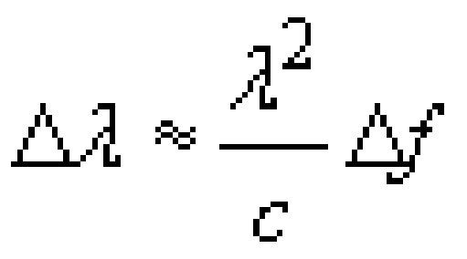

The frequency spacing, Δ*f*, is 1000 GHz (1012 Hz) and *c*, the speed of light (to three significant figures) is 3.00 × 108 m s−1. For *X*, λ, is 1550 nm, so that the wavelength spacing is:

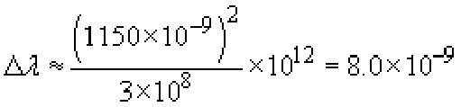

So *X*, the wavelength spacing in the 1550 nm window, is 8 nm.

For *Y*, λ is 1310 nm, so that the wavelength spacing is:

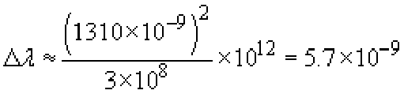

So *Y*, the wavelength spacing in the 1310 nm window, is 5.7 nm.
<!--ENDSAQ-->
Early applications of WDM were of the WWDM type, used with directional couplers for the multiplexing and demultiplexing (with λ1 = 1300 nm and λ2 = 1550 nm).

The characteristics and applications of CWDM are summarised in ITU-T Recommendation G.694.2:

<!--Quote id=quo001_033-->
>Coarse Wavelength Division Multiplexing (CWDM), a WDM technology, is characterised by wider channel spacing than Dense WDM (DWDM) as defined in G.671. CWDM systems can realise cost-effective applications, through a combination of uncooled lasers, relaxed laser wavelength selection tolerances and wide pass-band filters.
>CWDM systems can be used in transport networks in metropolitan areas for a variety of clients, services, and protocols.

and those of DWDM in Recommendation G.694.1:

<!--Quote id=quo001_034-->
>Dense Wavelength Division Multiplexing (DWDM), a WDM technology, is characterised by narrower channel spacing than Coarse WDM (CWDM) as defined in G.671. In general the transmitters employed in DWDM applications require a control mechanism to enable them to meet the application's frequency stability requirements, in contrast to CWDM transmitters which are generally uncontrolled in this respect.

The significance of the reference to ‘uncooled lasers’ is that in general the wavelength of light from a laser varies as the temperature changes. DWDM needs very stable wavelength sources, so the temperature of the lasers must be controlled. This is not necessary for CWDM.

Systems using DWDM generally also use optical amplifiers. Although DWDM can be used in links without amplifiers, it is the availability of amplifiers that has made DWDM so attractive. For one thing, wavelength multiplexers and demultiplexers tend to be quite lossy, so that without amplifiers the power budget available for the transmission path would be quite small. If a regenerative repeater were needed to extend the transmission distance it would have to demultiplex all the wavelength channels, detect each channel with a photodiode, regenerate each channel and then recreate the multiplexed optical signal. An optical amplifier, which amplifies all channels simultaneously, is much simpler.

ITU-T Recommendations G.694.1 and G.694.2 contain wavelength grids – tables of the wavelengths that should be used. The table for CWDM from G.694.2 uses 20 nm channel spacing and is reproduced in <a xmlns:str="http://exslt.org/strings" href="">Table 5</a>. For DWDM, G.694.1 recommends channels based on a grid spaced by 12.5 GHz (approximately 0.1 nm), as shown in <a xmlns:str="http://exslt.org/strings" href="">Table 6</a>. For systems using channel spacings of 25 GHz (approximately 0.2 nm) every alternate wavelength on the 12.5 GHz grid is used; for spacings of 50 GHz (approximately 0.4 nm) every fourth wavelength on the 12.5 GHz grid is used; and similarly for wider channel spacing.
<table xmlns:str="http://exslt.org/strings">
<caption>__Table 5__: Nominal central wavelengths for CWDM</caption>
<tbody>
<tr><th>Nominalcentral wavelengths (nm) for spacing of 20 nm</th></tr>
<tr>
<td class="highlight_" rowspan="" colspan="">1270</td>
<td class="highlight_" rowspan="" colspan="">1450</td>
</tr>
<tr>
<td class="highlight_" rowspan="" colspan="">1290</td>
<td class="highlight_" rowspan="" colspan="">1470</td>
</tr>
<tr>
<td class="highlight_" rowspan="" colspan="">1310</td>
<td class="highlight_" rowspan="" colspan="">1490</td>
</tr>
<tr>
<td class="highlight_" rowspan="" colspan="">1330</td>
<td class="highlight_" rowspan="" colspan="">1510</td>
</tr>
<tr>
<td class="highlight_" rowspan="" colspan="">1350</td>
<td class="highlight_" rowspan="" colspan="">1530</td>
</tr>
<tr>
<td class="highlight_" rowspan="" colspan="">1370</td>
<td class="highlight_" rowspan="" colspan="">1550</td>
</tr>
<tr>
<td class="highlight_" rowspan="" colspan="">1390</td>
<td class="highlight_" rowspan="" colspan="">1570</td>
</tr>
<tr>
<td class="highlight_" rowspan="" colspan="">1410</td>
<td class="highlight_" rowspan="" colspan="">1590</td>
</tr>
<tr>
<td class="highlight_" rowspan="" colspan="">1430</td>
<td class="highlight_" rowspan="" colspan="">1610</td>
</tr>
</tbody>
Reference: Source: ITU-T (2002) G.694.2, Table 1

</table>

*Note:* The end-points of this table are illustrative only.
<table xmlns:str="http://exslt.org/strings">
<caption>__Table 6__: Nominal central wavelengths for DWDM</caption>
<tbody>
<tr>
<th>Nominal central frequencies (THz) for spacings of:</th>
<th>Approximate nominal central wavelengths (nm)</th>
</tr>
<tr>
<th>12.5 GHz</th>
<th>25 GHz</th>
<th>50 GHz</th>
<th>100 GHz and above</th>
<th></th>
</tr>
<tr>
<td class="highlight_" rowspan="" colspan="">193.2375</td>
<td class="highlight_" rowspan="" colspan="">—</td>
<td class="highlight_" rowspan="" colspan="">—</td>
<td class="highlight_" rowspan="" colspan="">—</td>
<td class="highlight_" rowspan="" colspan="">1551.42</td>
</tr>
<tr>
<td class="highlight_" rowspan="" colspan="">193.2250</td>
<td class="highlight_" rowspan="" colspan="">193.225</td>
<td class="highlight_" rowspan="" colspan="">—</td>
<td class="highlight_" rowspan="" colspan="">—</td>
<td class="highlight_" rowspan="" colspan="">1551.52</td>
</tr>
<tr>
<td class="highlight_" rowspan="" colspan="">193.2125</td>
<td class="highlight_" rowspan="" colspan="">—</td>
<td class="highlight_" rowspan="" colspan="">—</td>
<td class="highlight_" rowspan="" colspan="">—</td>
<td class="highlight_" rowspan="" colspan="">1551.62</td>
</tr>
<tr>
<td class="highlight_" rowspan="" colspan="">193.2000</td>
<td class="highlight_" rowspan="" colspan="">193.200</td>
<td class="highlight_" rowspan="" colspan="">193.20</td>
<td class="highlight_" rowspan="" colspan="">193.2</td>
<td class="highlight_" rowspan="" colspan="">1551.72</td>
</tr>
<tr>
<td class="highlight_" rowspan="" colspan="">193.1875</td>
<td class="highlight_" rowspan="" colspan="">—</td>
<td class="highlight_" rowspan="" colspan="">—</td>
<td class="highlight_" rowspan="" colspan="">—</td>
<td class="highlight_" rowspan="" colspan="">1551.82</td>
</tr>
<tr>
<td class="highlight_" rowspan="" colspan="">193.1750</td>
<td class="highlight_" rowspan="" colspan="">193.175</td>
<td class="highlight_" rowspan="" colspan="">—</td>
<td class="highlight_" rowspan="" colspan="">—</td>
<td class="highlight_" rowspan="" colspan="">1551.92</td>
</tr>
<tr>
<td class="highlight_" rowspan="" colspan="">193.1625</td>
<td class="highlight_" rowspan="" colspan="">—</td>
<td class="highlight_" rowspan="" colspan="">—</td>
<td class="highlight_" rowspan="" colspan="">—</td>
<td class="highlight_" rowspan="" colspan="">1552.02</td>
</tr>
<tr>
<td class="highlight_" rowspan="" colspan="">193.1500</td>
<td class="highlight_" rowspan="" colspan="">193.150</td>
<td class="highlight_" rowspan="" colspan="">193.15</td>
<td class="highlight_" rowspan="" colspan="">—</td>
<td class="highlight_" rowspan="" colspan="">1552.12</td>
</tr>
<tr>
<td class="highlight_" rowspan="" colspan="">193.1375</td>
<td class="highlight_" rowspan="" colspan="">—</td>
<td class="highlight_" rowspan="" colspan="">—</td>
<td class="highlight_" rowspan="" colspan="">—</td>
<td class="highlight_" rowspan="" colspan="">1552.22</td>
</tr>
<tr>
<td class="highlight_" rowspan="" colspan="">193.1250</td>
<td class="highlight_" rowspan="" colspan="">193.125</td>
<td class="highlight_" rowspan="" colspan="">—</td>
<td class="highlight_" rowspan="" colspan="">—</td>
<td class="highlight_" rowspan="" colspan="">1552.32</td>
</tr>
<tr>
<td class="highlight_" rowspan="" colspan="">193.1125</td>
<td class="highlight_" rowspan="" colspan="">—</td>
<td class="highlight_" rowspan="" colspan="">—</td>
<td class="highlight_" rowspan="" colspan="">—</td>
<td class="highlight_" rowspan="" colspan="">1552.42</td>
</tr>
<tr>
<td class="highlight_" rowspan="" colspan="">193.1000</td>
<td class="highlight_" rowspan="" colspan="">193.100</td>
<td class="highlight_" rowspan="" colspan="">193.10</td>
<td class="highlight_" rowspan="" colspan="">193.1</td>
<td class="highlight_" rowspan="" colspan="">1552.52</td>
</tr>
<tr>
<td class="highlight_" rowspan="" colspan="">193.0875</td>
<td class="highlight_" rowspan="" colspan="">—</td>
<td class="highlight_" rowspan="" colspan="">—</td>
<td class="highlight_" rowspan="" colspan="">—</td>
<td class="highlight_" rowspan="" colspan="">1552.62</td>
</tr>
<tr>
<td class="highlight_" rowspan="" colspan="">193.0750</td>
<td class="highlight_" rowspan="" colspan="">193.075</td>
<td class="highlight_" rowspan="" colspan="">—</td>
<td class="highlight_" rowspan="" colspan="">—</td>
<td class="highlight_" rowspan="" colspan="">1552.73</td>
</tr>
<tr>
<td class="highlight_" rowspan="" colspan="">193.0625</td>
<td class="highlight_" rowspan="" colspan="">—</td>
<td class="highlight_" rowspan="" colspan="">—</td>
<td class="highlight_" rowspan="" colspan="">—</td>
<td class="highlight_" rowspan="" colspan="">1552.83</td>
</tr>
<tr>
<td class="highlight_" rowspan="" colspan="">193.0500</td>
<td class="highlight_" rowspan="" colspan="">193.050</td>
<td class="highlight_" rowspan="" colspan="">193.05</td>
<td class="highlight_" rowspan="" colspan="">—</td>
<td class="highlight_" rowspan="" colspan="">1552.93</td>
</tr>
<tr>
<td class="highlight_" rowspan="" colspan="">193.0375</td>
<td class="highlight_" rowspan="" colspan="">—</td>
<td class="highlight_" rowspan="" colspan="">—</td>
<td class="highlight_" rowspan="" colspan="">—</td>
<td class="highlight_" rowspan="" colspan="">1553.03</td>
</tr>
<tr>
<td class="highlight_" rowspan="" colspan="">193.0250</td>
<td class="highlight_" rowspan="" colspan="">193.025</td>
<td class="highlight_" rowspan="" colspan="">—</td>
<td class="highlight_" rowspan="" colspan="">—</td>
<td class="highlight_" rowspan="" colspan="">1553.13</td>
</tr>
<tr>
<td class="highlight_" rowspan="" colspan="">193.0125</td>
<td class="highlight_" rowspan="" colspan="">—</td>
<td class="highlight_" rowspan="" colspan="">—</td>
<td class="highlight_" rowspan="" colspan="">—</td>
<td class="highlight_" rowspan="" colspan="">1553.23</td>
</tr>
<tr>
<td class="highlight_" rowspan="" colspan="">193.0000</td>
<td class="highlight_" rowspan="" colspan="">193.000</td>
<td class="highlight_" rowspan="" colspan="">193.00</td>
<td class="highlight_" rowspan="" colspan="">193.0</td>
<td class="highlight_" rowspan="" colspan="">1553.33</td>
</tr>
<tr>
<td class="highlight_" rowspan="" colspan="">192.9875</td>
<td class="highlight_" rowspan="" colspan="">—</td>
<td class="highlight_" rowspan="" colspan="">—</td>
<td class="highlight_" rowspan="" colspan="">—</td>
<td class="highlight_" rowspan="" colspan="">1553.43</td>
</tr>
<tr>
<td class="highlight_" rowspan="" colspan="">192.9750</td>
<td class="highlight_" rowspan="" colspan="">192.975</td>
<td class="highlight_" rowspan="" colspan="">—</td>
<td class="highlight_" rowspan="" colspan="">—</td>
<td class="highlight_" rowspan="" colspan="">1553.53</td>
</tr>
<tr>
<td class="highlight_" rowspan="" colspan="">192.9625</td>
<td class="highlight_" rowspan="" colspan="">—</td>
<td class="highlight_" rowspan="" colspan="">—</td>
<td class="highlight_" rowspan="" colspan="">—</td>
<td class="highlight_" rowspan="" colspan="">1553.63</td>
</tr>
</tbody>
Reference: *Source:* ITU-T (2002) G.694.1, Extract from Table 1

</table>
<!--SAQ id=saq004_003-->

### SAQ 14

#### Question

In what band are the frequencies of <a xmlns:str="http://exslt.org/strings" href="">Table 6</a>? If the whole of this band could be filled with channels at 25 GHz spacing, how many channels in total would there be?

You will need to convert from wavelengths to frequency, using *f* = *c*/λ, where fis the frequency, λ (lambda) the free-space wavelength and *c* the speed of light, which, to six significant figures, is 2.99792 × 108 ms−1.

If each channel carries an STM-64, what will be the total data rate carried by the fibre?

At the time of writing, commercial products are available that can support up to 160 STM-64 channels.

#### Answer

The wavelengths of <a xmlns:str="http://exslt.org/strings" href="">Table 6</a> are all in the C-band.

The C-band extends from 1530 nm to 1565 nm, which is, in terms of frequency, from

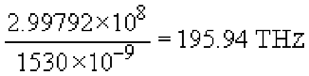

to

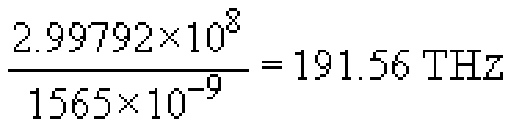

This is a range of 195.94 − 191.56 = 4.38 THz, and at a spacing of 25 GHz (0.025 THz) per channel that would allow 4.38/0.025 = 175.2 channels. Rounding down, that would in practice be 175 channels.

If each channel carries an STM-64 this is a total capacity of approximately 175610 Gbit/s = 1.75 Tbit/s.
<!--ENDSAQ-->

## 4.3 Optical networking

DWDM improves the utilisation of optical fibre for point-to-point links, but a further step in exploiting the potential of optical fibre comes from optical networking in which routeing or switching is done optically.

Optical networking is in its infancy, but the concept of the optical layer based upon wavelength channels is emerging. The optical layer effectively sits below the SDH layer in the network, and provides wavelength channels from one location to another.

An analogy can be drawn between networking with SDH and the optical network, where wavelength channels in the optical layer perform the equivalent function to containers in SDH. Then, as SDH transports containers across a network, so the optical layer transports wavelengths. A DWDM transmission link is the equivalent of an STM-*n*.

### Activity 16

#### Question

Can you think what function would be required of optical equivalents of cross-connects and add/drop multiplexers?

#### Discussion

Add/drop multiplexers would have to extract and replace individual wavelength channels, as in <a xmlns:str="http://exslt.org/strings" href="">Figure 28</a> (a). Cross-connects would have to interconnect wavelength channels between different DWDM links, as in Figure 28(b).

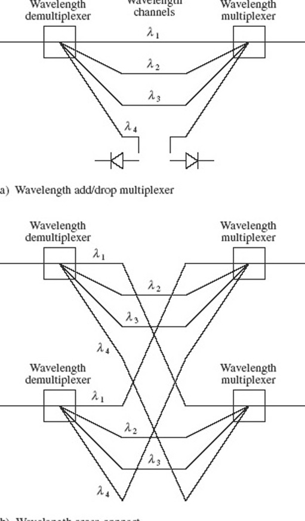

Figure 28 Optical cross-connects and add/drop multiplexer.

### Activity 17

#### Question

The space switching shown in <a xmlns:str="http://exslt.org/strings" href="">Figure 28(b)</a> can be done with MEMS switches (<a xmlns:str="http://exslt.org/strings" href="">Figure 25</a>), but the resulting cross-connect will not be as flexible as it might first appear. Can you see in what way it is limited, and what more is needed for full flexibility?

#### Discussion

Incoming wavelengths have to go to the same wavelength channels in the output, as it stands. For a fully flexible switch, wavelength conversion is needed. (It is like being able to do time-multiplexed space switching of PCM channels, but not being able to do time switching.)

It is possible to perform wavelength conversion by going via an electrical signal – detecting the optical signal at one wavelength and generating another optical signal at a different wavelength. More flexibility then comes from having wavelength-tunable lasers. An ‘all-optical’ device would be preferable, however, and experimental devices exist that can do this, but wavelength converters are perhaps the least-developed devices that are required for a universal optical layer.

## 4.4 Fibre in the access network

In the 1980s there was a belief that it was only a matter of time before fibre would be installed in the access network (from individual private customers to the local telephone exchange, also called ‘the last mile’, the ‘local loop’ and, now, the ‘first mile’). Installing ‘fibre to the home’, FTTH, as this has come to be known, was always recognised to be a major undertaking, simply because of the number of links involved. If, however, the revenue from new services enabled by the large bandwidth of optical fibre is sufficient, then telecommunications operators would be able to finance the development. Over the years, therefore, operators have looked for bandwidth-hungry ‘killer applications’ that might justify FTTH. For a while it was hoped that ‘video on demand’ would fulfil that role, and now with the expansion of the Internet there is increasing demand for broadband Internet access. Though there have been a number of trials with FTTH, to date none of them has demonstrated that it is a commercial proposition.

---

4.4.1 FTTCab, FTTC, FTTB and hybrid coaxial fibre
The equipment needed at optical-fibre transmitters and receivers (lasers, photodiodes and the associated electronics) is more expensive than the equivalent for transmission over copper cables. With FTTH this equipment is needed in every home, and a substantial cost reduction is possible with schemes where the fibre doesn't go all the way to the home, but stops short, and copper links run from a shared fibre to several homes (<a xmlns:str="http://exslt.org/strings" href="">Figure 29</a>). This is the basis of several schemes, such as *fibre to the cabinet*, FTTCab.

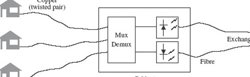

Figure 29 Fibre to the cabinet

Typically in FTTCab the signals for all the attached houses are multiplexed onto a single fibre (or rather a pair of fibres, one for each direction of transmission) and equipment in the street cabinet performs conversion between the electrical and the optical signals as well as multiplexing and demultiplexing. FTTCab exploits the capacity and low attenuation of fibre while only needing a single pair of optical transmitters and receivers shared between several houses (maybe tens or even hundreds of houses might share the one fibre), and links from the cabinet to the houses would typically use twisted-pair cables.

FTTC is *fibre to the curb/kerb* (where ‘curb’ is the US spelling of ‘kerb’), and is really the same as FTTCab but taken closer to the homes, so that each fibre serves fewer houses. The split is done in a hub located on the kerb to serve the nearby houses.

FTTB, *fibre to the building*, goes further, taking the fibre into a building, but the building is typically a block of flats or some other shared building and the drop to the individuals is over copper, as with FTTCab and FTTC.

### FTTX

All these acronyms beginning FTT, which are to do with getting fibre closer to the user, are sometimes grouped together under the heading ‘FTTX’ – with the ‘X’ as a sort of variable that can be B, C or whatever. They are not at all standardised and authors tend to pick any that suits them at the time. A colleague wondered if he needed FTTDch because there is a ditch at the front of his house!

In general terms, going from FTTCab through FTTC and FTTB to FTTH represents reduced sharing of the capacity of a single fibre but increased cost. The different schemes correspond to different positions on the trade-off between cost and capacity per user, where fibre to the home is the most expensive but gives the user the most capacity.

Cable TV networks have traditionally used coaxial cable for signal distribution, because coaxial cable has better performance at the high frequencies that were needed for (analogue) TV signals. The same economic arguments apply to converting cable TV networks to fibre as to telecommunications networks, and similar to FTTCab for cable TV is the *hybrid fibre coax* (HFC) scheme, where the final ‘drop’ to the user is over coaxial cable.

---

4.4.2 Passive optical networks and Ethernet in the first mile
If FTTH uses a dedicated fibre link between each house and the telephone exchange then each house carries the cost of two sets of terminal equipment: one in the house and one in the exchange.

A significant saving can be made with the *passive optical network* (PON) configuration (<a xmlns:str="http://exslt.org/strings" href="">Figure 30</a>). Here, as with FTTCab, a single fibre runs from the exchange to a hub, but now the splitting is done in the fibre (with a splitter like that described in Section 3.1) and the drop to each house is over fibre. With this configuration there is an optical terminal in each house, but the terminal at the exchange is shared between several houses. It is possible, furthermore, to have *transceivers* - combined transmitters and receivers – on the fibre and use one fibre for both directions of transmission.

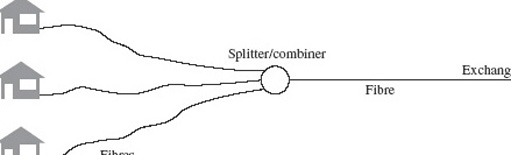

Figure 30 A passive optical network

In the downstream direction – from the exchange to the home – multiplexed signals for all users are broadcast to all users, and the equipment in the home has to extract its ‘own’ signal. In the upstream direction there needs to be some mechanism for ensuring that the signals from each user do not interfere with each other, and the equipment at the exchange has to be able to extract and identify signals from each user. These are significant problems; trials of PONs have been run and the concept found to be technically feasible, but as with other FTTH experiments the economics are still in question.

One specific use of the PON concept is the *Ethernet passive optical network* (EPON) in the *Ethernet in the first mile* (EFM) standard being developed by the 802.3ah EFM Task Force of the IEEE 802 LAN/MAN standards committee.

## 4.5 Fibre in LANs

Fibre has been slower to be exploited in LANs than in the core transmission network, for similar reasons to the delay in the use of fibre in the access network, but as the data rate demanded of LANs has increased, the case for using fibre has strengthened.

Although Ethernet specifications (IEEE 802.3 series) have contained standards for the use of fibre backbones for some time, it was with the development of Gigabit Ethernet and 10 Gigabit Ethernet (10 GbE) standards that fibre became the main transmission medium. This section very briefly summarises the use of fibre in these two standards.

In this context 1300 nm is ‘long’ – because it is longer than 800 nm. In other contexts ‘long’ means wavelengths in the 1550 nm window in contrast to the ‘short’ 1300 nm window. And you have already met references to S-band, C-band and L-band, where ‘long’ means 1565–1625 nm and ‘short’ means 1460–1530 nm. It just goes to show that you have to be very careful with terms like long and short.

---

4.5.1 Gigabit Ethernet
Gigabit Ethernet specifies four categories:

* 
1000BASE-SX, for transmission over multimode fibre using an LED in the 800 nm window (the wavelength is specified to be between 770 and 860 nm). The specification is for up to 275 m on 62.5/125 mm multimode fibre, or 550 m on 50/125 mm multimode fibre;

* 
1000BASE-LX, for transmission over multimode or single-mode fibre using a laser in the 1300 nm window (specified to be between 1270 and 1355 nm). The distance on both 62.5/125 mm and 50/125 mm multimode fibre is specified as 550 m, and on single-mode fibre as 5 km;

* 
1000BASE-CX specifies transmission on a shielded twisted-pair copper cable up to 25 m;

* 
1000BASE-T specifies transmission on four pairs of unshielded twisted pairs up to 100 m.

In this context 1300 nm is ‘long’ - because it is longer than 800 nm. In other contexts ‘long’ means wavelengths in the 1550 nm window in contrast to the ‘short' 1300 nm window. And you have already met references to S-band, C-band and L-band, where ‘long’ means 1565-1625 nm and ‘short’ means 1460-1530 nm. It just goes to show that you have to be very careful with terms like long and short.

---

4.5.2 10 Gigabit Ethernet
The standard for 10 Gigabit Ethernet (IEEE 802.3ae, lOGbE) was approved in July 2002. The main use of lOGbE, initially at least, is for backbone networks which interconnect 10, 100 or 1000 Mbit/s Ethernet hubs. These hubs might be widely separated geographically, so the standard includes physical layer specifications specifically for WAN (wide area network) applications as well as LAN applications. The WAN specification is for operation at slightly under 10 Gbit/s, 9.95328 Gbit/s, so as to be compatible with the SDH.
<!--SAQ id=saq004_004-->

### SAQ 15

#### Question

What level in the SDH hierarchy runs at 9.95328 Gbit/s?

#### Answer

9.95328 Gbit/s is the transmission rate of STM-64.
<!--ENDSAQ-->
Both the WAN and LAN physical layers can use optical interfaces specified for use at 850 nm, 1310 nm and 1550 nm as follows (<a xmlns:str="http://exslt.org/strings" href="">Figure 31</a>):

* 
10GBASE-S operates with a directly modulated 850 nm multimode laser diode and graded-index multimode fibre, at distances up to 300 metres;

* 
10GBASE-L operates with a directly modulated 1310 nm single-mode laser diode and single-mode fibre, at distances up to 10 km;

* 
10GBASE-E operates with an externally modulated 1550 nm single-mode laser diode and single-mode fibre, at distances up to 40 km.

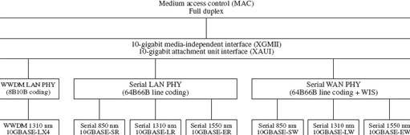

Figure 31 10 Gigabit Ethernet

<!--SAQ id=saq001_005-->

### SAQ 16

#### Question

If a 10GBASE-S interface used 50/125 mm fibre meeting the bandwidth-distance specification for Gigabit Ethernet of 500 MHz·km, approximately how far could the signal be transmitted? (The signalling rate of the 10GBASE-S interface is approximately 10.3 Gbaud.)

#### Answer

The minimum bandwidth that will allow a signalling rate of 10.3 Gbaud is:

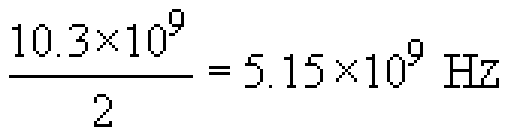

The maximum transmission distance is therefore:

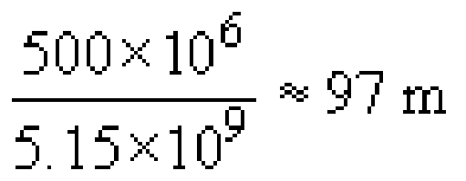
<!--ENDSAQ-->
A target in the development of lOGbE was for a distance of at least 300 m on multimode fibre, and it is clear from the answer to SAQ 16 that this would not be possible with the 10GBASE-S interface on fibre that just meets the Gigabit Ethernet specification.

There are two solutions to this in 1 OGbE. One is to use new multimode fibre that has been developed with a higher specification, specifically for 1 OGbE. Referred to as ‘10 Gigabit Ethernet fibre’, this has a typical bandwidth-distance product of 2000 MHz·km.

### Activity 18

#### Question

What distance would be possible with this fibre?

#### Discussion

Repeating the calculation of SAQ 16 using the new specification leads to a distance of 2000/5150 = 388 m.

With this fibre the 300 m target can therefore be met (assuming that the power budget can also be balanced at 300 m).

The other solution is based on an additional interface specification, used only for the LAN physical layer (i.e. not the WAN physical layer), the 10GBASE-LX4 interface.

10GBASE-LX4 splits the data into four parallel streams and transmits them on four different wavelengths on a fibre. It therefore uses a type of WDM. The four wavelengths used are 1280 nm, 1300 nm, 1320 run and 1340 nm.

### Activity 19

#### Question

Into which of the ITU categories of WDM (CWDM, DWDM or WWDM) does this fit?

#### Discussion

The wavelength spacing (20 nm) makes it coarse wavelength division multiplexing, CWDM, although the actual wavelengths used are not those suggested in Recommendation G.694.2.

If you see reference to WWDM, make sure you know precisely what it means in context.

Unfortunately, although it most closely matches CWDM, the committee developing the IEEE 802.3ae standard chose to describe the scheme as wide wavelength division multiplexing, WWDM. The scheme most clearly does *not* fit with the ITU definition of WWDM.

10GBASE-LX4 can use either directly modulated multimode laser diodes or directly modulated single-mode laser diodes, and either multimode fibre (when it is specified to 300 m) or single-mode fibre (when it is specified to 10 km).

On multimode fibre it is capable of 300 m on existing (Gigabit Ethernet compliant) fibre.

---

4.6 Conclusion to Section 4
This brief account has introduced a few of the most rapidly developing areas of optical-fibre communications as of January 2004. By the time you are reading it things will certainly have moved on, and if you want to find the current state of the art you should read journals such as *IEEE Communications Magazine* or trade magazines such as *Lightwave*. It is also possible to find out more on the world wide web.

I hope you will agree that this is a fascinating field, and that you will be encouraged to study it further.

